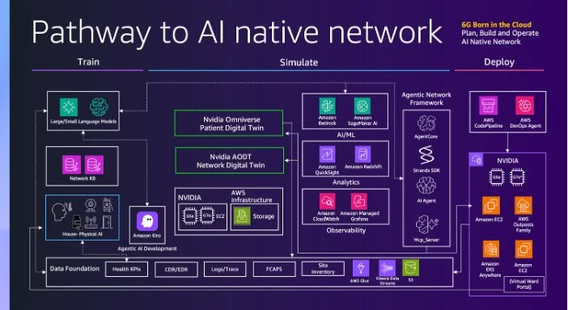

# PHYSICAL AI IN HEALTHCARE: REDEFINING CARE DELIVERY AT THE EDGE

Được trình diễn tại sự kiện Mobile World Congress (MWC) 2026 thông qua sự hợp tác giữa **AWS, NVIDIA và đối tác AI-SENSE**, dự án ứng dụng **Physical AI (Trí tuệ nhân tạo vật lý)** vào lĩnh vực y tế, hướng tới việc đưa khả năng chăm sóc và theo dõi bệnh nhân từ bệnh viện về tận nhà. Khác với AI thông thường, Physical AI có khả năng cảm nhận, suy luận và hành động trực tiếp trong môi trường thực tế, hoạt động dựa trên phác đồ điều trị do bác sĩ xác định nhằm hỗ trợ chăm sóc và ra quyết định lâm sàng, chứ không thay thế đội ngũ y tế.

Các điểm chính cần nắm:

* **Virtual Ward (Phòng bệnh ảo):** biến nhà bệnh nhân thành không gian chăm sóc gần tương đương bệnh viện, dùng mạng lưới cảm biến và thiết bị đeo để theo dõi liên tục nhịp tim, huyết áp, SpO2, nhịp thở — AI phân tích và có thể tự động điều chỉnh thiết bị hoặc cảnh báo đội ngũ y tế khi cần.
* **Health Buddy (Y tá ảo):** dùng AI giao tiếp tự nhiên để tương tác, đánh giá triệu chứng, nhắc uống thuốc, hướng dẫn vật lý trị liệu và cảnh báo bác sĩ khi chỉ số vượt ngưỡng an toàn — đặc biệt hữu ích cho bệnh nhân mãn tính, hậu phẫu hoặc sa sút trí tuệ.
* Hệ thống vận hành theo vòng lặp 5 bước **Agentic Application Maturity Flywheel**, dựa trên 3 trụ cột: AI-native Network, Agentic AI và Digital Twin Simulation.
* Mô hình LLM chuyên ngành y tế được huấn luyện trên **Amazon Bedrock & Amazon SageMaker**, và được mô phỏng/kiểm chứng trong **NVIDIA Omniverse** chạy trên hạ tầng GPU của AWS trước khi triển khai thực tế.
* Ứng dụng được triển khai tại vùng biên (edge) qua **AWS Outposts & Amazon EKS Anywhere**, đạt độ trễ dưới 10ms để có thể can thiệp theo thời gian thực.
* Dữ liệu vận hành thực tế được thu thập, tích hợp qua **AWS Glue** để liên tục retrain và cải thiện mô hình.
* Mạng kết nối thế hệ mới (hướng tới 6G) đóng vai trò như "hệ thần kinh thông minh", đảm bảo độ trễ thấp và hỗ trợ mật độ lớn thiết bị trong môi trường chăm sóc tại nhà.

Lợi ích nổi bật mà hệ thống mang lại: giảm tải cho bệnh viện (xuất viện sớm hơn, hạn chế nhập viện không cần thiết); cải thiện kết quả điều trị nhờ phát hiện sớm dấu hiệu suy giảm sức khỏe; mở rộng khả năng tiếp cận y tế cho vùng sâu vùng xa hoặc người hạn chế đi lại; hỗ trợ bác sĩ ra quyết định nhanh hơn nhờ dữ liệu đã được AI chọn lọc; và tiết kiệm chi phí so với điều trị nội trú.

Đánh giá cá nhân:

Điểm nổi bật nhất của dự án, theo mình, là việc dùng **Digital Twin Simulation (NVIDIA Omniverse)** để kiểm chứng các tình huống chăm sóc trước khi áp dụng thực tế — cách tiếp cận này giúp giảm đáng kể rủi ro khi đưa AI vào một lĩnh vực nhạy cảm như y tế. Tuy nhiên, mô hình phụ thuộc rất lớn vào hạ tầng mạng viễn thông: yêu cầu độ trễ dưới 10ms và định hướng 6G khiến việc triển khai ở những khu vực có hạ tầng internet chưa đồng bộ sẽ gặp nhiều thách thức. Bên cạnh đó, vì xử lý dữ liệu sức khỏe cá nhân, các yêu cầu về bảo mật, quyền riêng tư và tuân thủ quy định y tế cũng cần được ưu tiên hàng đầu.

Nhìn chung, đây không chỉ là một ý tưởng thử nghiệm mà là một minh chứng triển khai thực tế trên hạ tầng thật, kết hợp AWS, NVIDIA và AI-SENSE để đưa Physical AI vào chăm sóc sức khỏe — mở rộng không gian chăm sóc vượt ra khỏi tường bệnh viện, đúng như thông điệp của dự án: bệnh viện của tương lai không có tường, mà có trí tuệ.

Hình ảnh :

Link bài viết gốc: <https://aws.amazon.com/blogs/physical-ai/physical-ai-in-healthcare-redefining-care-delivery-at-the-edge/>
