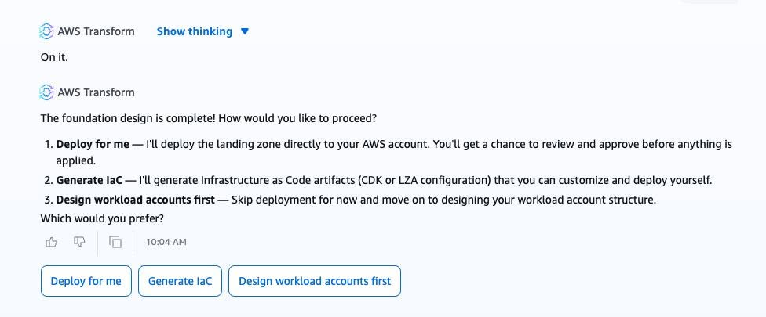

# AUTOMATING LANDING ZONE SETUP IN HOURS WITH AWS TRANSFORM (AI-POWERED)

Designing and building a proper Landing Zone — achieving Multi-AZ, separating Public/Private Subnets, decomposing Security/Workload OUs, applying SCPs... in line with the AWS Well-Architected framework — typically takes **4 to 12 weeks**. With **AWS Transform**, this timeline is compressed down to just hours, thanks to the application of AI in the infrastructure design and deployment process.

The tool's most notable highlights:

* **Natural-language chat:** the AI Agent acts as a Mentor/Architect, using information about the migration project (Migration Waves) to recommend an appropriate account configuration. Users can chat, push back, and ask the AI to adjust the design before applying it.
* **Human-In-The-Loop (HITL):** the AI does not change infrastructure on its own — it only provides recommendations and generates code (AWS CDK or LZA YAML); the authority to click Deploy and Approve still belongs to the Admin.
* **Can scan existing (Brownfield) infrastructure:** for those who already have infrastructure in place, the AI can still scan it and point out gaps, such as a missing Sandbox OU or a missing SCP blocking the Root user, so they can be addressed promptly.

Alongside these advantages, the article also notes a few points to consider when using the tool:

* **Free, but not entirely free:** AWS Transform itself is free, but the services it automatically activates alongside it, such as AWS Control Tower, Config, and CloudTrail, are still billed on the account — if you set up a test lab and forget to turn them off, this can incur significant costs.
* **Decommissioning is fairly complex:** tearing down an AI-built Landing Zone is not straightforward, and careless handling can result in the loss of important enterprise log data.

Personal assessment:

The combination of AI and Infrastructure as Code (CDK/LZA) is gradually changing the way a DevOps/Cloud Engineer works — the infrastructure provisioning step becomes much easier, and the focus of the job shifts from "writing infrastructure code" to "supervising and approving architecture." This is a notable trend as AI becomes increasingly involved in cloud operations tasks, while still retaining an element of control (HITL) — which is important for enterprise-scale infrastructure systems.

...Image... 

Original article link: <https://aws.amazon.com/vi/blogs/migration-and-modernization/automate-your-landing-zone-creation-with-aws-transform/>

...Instructions...