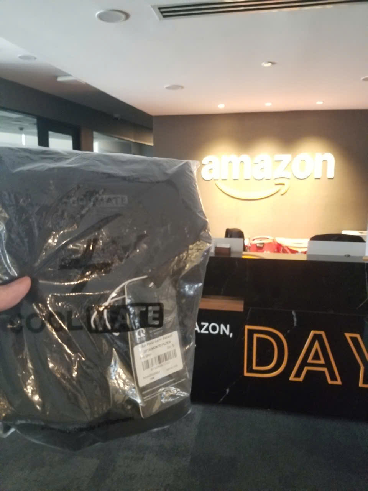

# Bài thu hoạch “23-05-2026 | FCAJ Community Day”

### Mục Đích Của Sự Kiện

- **Tối ưu hóa ứng dụng AI thực tế**: Hiểu sâu về cách cung cấp ngữ cảnh (Context), quản lý tính bất định (Non-Determinism) của LLM và xây dựng hệ thống Multi-Agent cho doanh nghiệp.
- **Tiếp cận công cụ không code (No-code AI)**: Làm quen với giải pháp tự động hóa quy trình và phân tích dữ liệu bằng ngôn ngữ tự nhiên thông qua Amazon Quick.
- **Làm chủ hạ tầng Cloud**: Nắm vững các chiến lược tối ưu chi phí, hiệu năng và bảo mật toàn diện cho mọi khối lượng công việc bằng Amazon CloudFront.
- **Học hỏi kinh nghiệm thực chiến**: Đúc kết bài học từ hành trình phát triển sản phẩm công nghệ áp lực cao dưới 36 tiếng tại cuộc thi Hackathon.

### Danh Sách Diễn Giả

- **Tinh Truong** - Platform Engineer tại GoTymeX
- **Anh Pham** - Speaker chia sẻ về giải pháp Amazon Quick
- **Thinh Nguyen** - Chuyên gia về hạ tầng mạng và CloudFront
- **Team VIB** - Đội ngũ phát triển dự án UTMorpho tại LotusHacks
- **Duc Dao** - Chuyên gia nghiên cứu tối ưu hóa mô hình LLM
- **Vy Lam** - Chuyên gia giải pháp hệ thống AI doanh nghiệp

---

### Nội Dung Nổi Bật

#### 1. Context Is Everything: Making AI Actually Work for You (Speaker: Tinh Truong)
- **Lý do AI thất bại**: Mô hình AI vốn rất mạnh mẽ nhưng kết quả đầu ra thường kém chất lượng nếu thiếu đi "ngữ cảnh" (Context) đầu vào rõ ràng.
- **Sự dịch chuyển công nghệ**: Cách thức sử dụng AI đang tiến hóa từ việc tối ưu câu lệnh đơn lẻ (Prompts) sang xây dựng hệ thống quản lý bộ nhớ dài hạn, hướng tới khái niệm *"Não bộ AI thứ hai" (Second AI Brain)*.
- **Tư duy thực tế**: Cung cấp các mẹo cốt lõi giúp tối ưu hóa ngữ cảnh để nhận được kết quả chính xác cao, đồng thời chia sẻ lộ trình cho sinh viên bắt đầu tự xây dựng ứng dụng với AI.

#### 2. Friendly AI Assistant with Amazon Quick (Speaker: Anh Pham)
- **Quick Chat Agent & Quick Sight**: Giới thiệu trợ lý AI thông minh hỗ trợ khám phá, phân tích insight dữ liệu chuyên sâu và tự động xây dựng các dashboard, report trực quan từ dữ liệu thô hoàn toàn bằng ngôn ngữ tự nhiên.
- **Quick Flows**: Cho phép người dùng tự tạo ra các quy trình làm việc thông minh (intelligent workflows) mà không cần viết bất kỳ dòng code nào.
- **Quick Spaces**: Tạo không gian cộng tác chung, giúp chuyển hóa các insight của cá nhân thành kho tàng tri thức chung của toàn bộ đội ngũ.

#### 3. From Edge To Origin: CloudFront as Your Foundation (Speaker: Thinh Nguyen)
- **Nền tảng hạ tầng toàn diện**: Khẳng định Amazon CloudFront là giải pháp tối ưu cho mọi loại Workload nhờ khả năng tăng cường hiệu năng đỉnh cao tại vùng biên (Edge).
- **Chiến lược tối ưu hóa**: Phân tích sâu về phương pháp tối ưu chi phí (Cost optimization), nâng cao tính sẵn sàng / độ tin cậy (Enhanced reliability) và tích hợp các lớp bảo mật toàn diện bảo vệ hệ thống ngay từ Origin.

#### 4. 36 hrs with LotusHacks – Building UTMorpho from Idea to Reality (Speaker: Team VIB)
- **Hành trình vượt áp lực**: Chia sẻ trải nghiệm thực tế từ lúc tìm kiếm ý tưởng (Brainstorming), định hình bài toán cốt lõi để xây dựng nên dự án **UTMorpho** trong guồng quay 36 tiếng liên tục của cuộc thi LotusHacks.
- **Bài học từ thất bại**: Phân tích các rào cản kỹ thuật, những bước ngoặt quan trọng khi đối mặt với áp lực thời gian, đi kèm là bản demo sản phẩm thực tế và định hướng phát triển tiếp theo của dự án.

#### 5. Non-Determinism of "Deterministic" LLM Settings (Speaker: Duc Dao)
- **Bản chất của LLM**: Khám phá cơ chế chọn token tiếp theo (next token selection) của các mô hình ngôn ngữ lớn.
- **Phá vỡ lầm tưởng**: Làm rõ một sai lầm phổ biến cho rằng cài đặt `Temperature = 0` sẽ đảm bảo tính ổn định tuyệt đối (determinism). Thực tế, các thuật toán tối ưu hóa hạ tầng tính toán (Inference optimizations) vẫn tạo ra những kết quả khác biệt.
- **Giải pháp**: Đánh giá các tác động thực tế của tính bất định này lên ứng dụng và đề xuất các chiến lược giảm thiểu rủi ro (Mitigation strategies).

#### 6. Enterprise-Grade Multi-Agent System: Credit Scoring Case (Speaker: Vy Lam)
- **Giải quyết bài toán doanh nghiệp**: Khắc phục sự bất đối xứng dữ liệu giữa hệ thống ngân hàng truyền thống và dữ liệu linh hoạt của các startup.
- **Mô hình Multi-Agent**: Phân tích khi nào nên dùng Single Agent và khi nào cần chuyển dịch sang hệ thống đa đại lý (Multi-Agent). Minh họa bằng sơ đồ kiến trúc *Hội đồng tín dụng ảo (Virtual Credit Committee)*.
- **Vận hành chuẩn doanh nghiệp**: Cách thiết lập hàng rào bảo mật (Guardrails), đảm bảo tính tuân thủ pháp lý (Compliance) đi kèm lộ trình triển khai và tính toán chỉ số ROI của hệ thống.

---

### Những Gì Học Được

#### Tư Duy Thiết Kế Hệ Thống & AI
- **Context-driven Design**: Hiểu rằng sức mạnh của AI phụ thuộc vào chất lượng hệ thống ngữ cảnh đi kèm. Việc thiết kế bộ nhớ cho AI (Second AI Brain) quan trọng hơn việc chỉ tối ưu Prompt.
- **Nhìn nhận thực tế về công nghệ**: Chấp nhận tính bất định (Non-determinism) của LLM để thiết kế các giải pháp phòng ngừa, thay vì kỳ vọng AI hoạt động như một hàm code logic thông thường.
- **Mô hình hóa nghiệp vụ phức tạp**: Học cách chia nhỏ bài toán lớn của doanh nghiệp (như chấm điểm tín dụng) thành các tác vụ chuyên biệt cho từng Agent phối hợp xử lý.

#### Kiến Trúc Hạ Tầng & Tự Động Hóa
- Ý thức được vai trò cốt lõi của mạng phân phối nội dung (CDN) như CloudFront trong việc chịu tải, bảo mật và giảm chi phí hạ tầng.
- Tiếp cận tư duy No-code/Low-code thông qua các công cụ như Amazon Quick để tăng tốc độ phân tích dữ liệu và tối ưu hóa quy trình làm việc nhóm.

#### Bài Học Về Phát Triển Sản Phẩm (Product Delivery)
- Quy trình đưa một ý tưởng từ sơ khai đến bản demo chạy được (MVP) dưới áp lực thời gian ngặt nghèo cần sự tập trung cao độ vào tính năng cốt lõi và sự phối hợp ăn ý trong team.

---

### Ứng Dụng Vào Công Việc & Học Tập

- **Nâng cấp cách tương tác với AI**: Xây dựng cấu trúc dữ liệu nền tảng làm ngữ cảnh rõ ràng trước khi prompt code hoặc làm tiểu luận nhằm giảm thiểu tối đa việc AI đưa ra thông tin sai lệch.
- **Thử nghiệm kiến trúc AI nâng cao**: Nghiên cứu sâu hơn về cơ chế thiết lập Agent và thử nghiệm tự xây dựng một hệ thống Multi-Agent cơ bản áp dụng cho bài tập lớn ở trường.
- **Ứng dụng No-code vào phân tích dữ liệu**: Tận dụng các tính năng tận dụng ngôn ngữ tự nhiên như của Amazon Quick nhằm tăng tốc độ tạo báo cáo, phân tích số liệu học tập mà không cần cấu hình dashboard thủ công phức tạp.
- **Tối ưu hóa đồ án môn học**: Triển khai tích hợp Amazon CloudFront cho các bài tập lớn/đồ án web-app nhằm tăng tốc độ tải trang, tối ưu hóa băng thông và làm quen với các thiết lập bảo mật thực tế.

---

### Trải Nghiệm Trong Event

Tham gia ngày hội công nghệ **FCAJ Community Day** tại tầng 26 là một trải nghiệm học tập và định hướng nghề nghiệp vô cùng giá trị đối với bản thân tôi:

#### Tiếp cận kiến thức đa chiều và thực tế
- Khác với các buổi học lý thuyết, sự kiện mang đến một dải kiến thức cực rộng: từ hạ tầng Cloud cốt lõi (CloudFront) cho đến những làn sóng công nghệ mới nhất như AI Agent hay No-code workflow.
- Các diễn giả chia sẻ thẳng thắn vào các góc khuất công nghệ (như việc `Temperature = 0` vẫn không hoàn toàn ổn định) giúp tôi có cái nhìn thực tế, bớt mơ mộng hơn về AI.

#### Nguồn cảm hứng lớn từ các dự án thực chiến
- Phiên chia sẻ 36 giờ vượt khó tại Hackathon của Team VIB mang lại nguồn động lực rất lớn. Nó giúp tôi hiểu được tinh thần chiến đấu dưới áp lực, cách đối mặt với thất bại và xoay chuyển tình thế để hoàn thiện sản phẩm một cách nhanh nhất.

#### Định hướng nghề nghiệp rõ ràng
- Thông qua các case study thực tế của doanh nghiệp (như hệ thống chấm điểm tín dụng của chị Vy Lam hay kiến trúc của anh Tinh Truong), tôi định hình rõ ràng hơn các kỹ năng mà thị trường đang khát, từ đó chủ động bổ sung vào lộ trình học tập tại trường của mình.

#### Một số hình ảnh khi tham gia sự kiện
