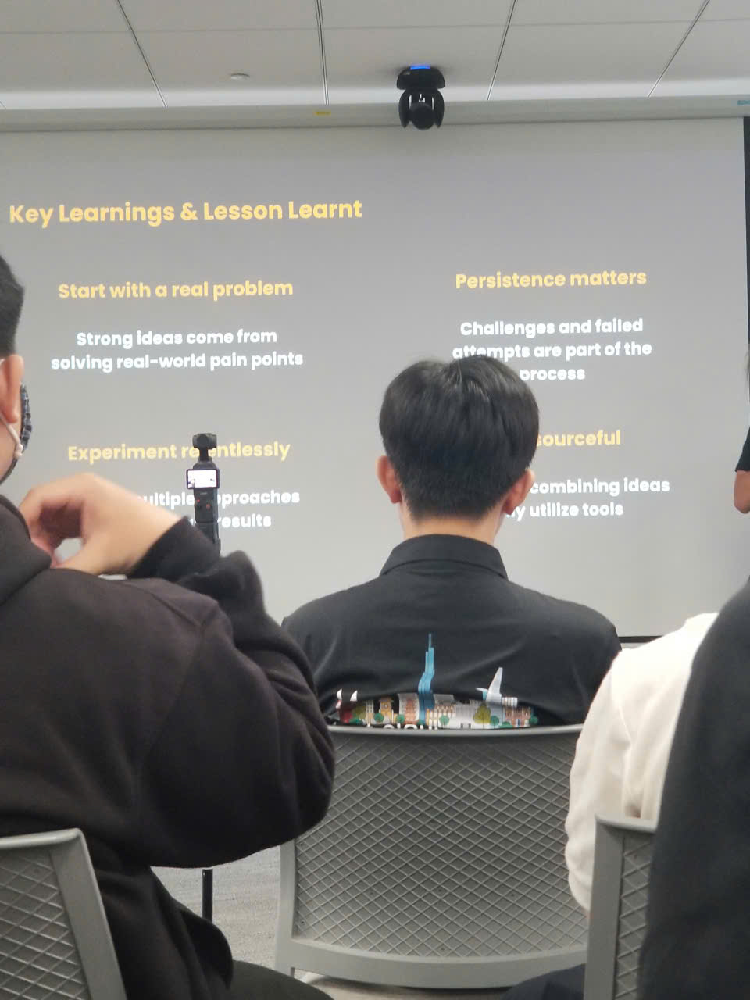

# Event Report “24-05-2026 | FCAJ Community Day - AI Wave & System Automation”

### Event Objectives

- **Revolutionizing Cloud Operations**: Approach the trend of automated incident resolution (Autonomous Resolution) and optimize DevOps workflows using next-generation intelligent AI assistants.
- **Enhancing Interactive Experiences (AI Voice)**: Explore the architecture of building intelligent voice agents, managing latency, and increasing natural interaction in large-scale communication.
- **Optimizing Enterprise Productivity**: Apply AI to advanced Human Resources (HR) workforce analytics and strategic workforce planning.
- **Securing AI Connectivity**: Master methods for establishing secure connections using the MCP (Model Context Protocol) within enterprise cloud network environments.

### List of Speakers

- **Session 1**: Cloud Operations Specialist
- **Session 2**: AI/ML Voice and Intelligent Conversation Solutions Engineer
- **Session 3**: AWS DevOps Agent Solutions Expert
- **Session 4**: Digital HR Solutions Consultant utilizing Amazon Quick
- **Session 5**: Systems Security and Cloud Network Architecture Engineer

---

### Key Highlights

#### 1. Deep Response Engine: From Detection to Autonomous Resolution
- **Modern Operations Barriers**: The complexity of today's cloud operations has scaled beyond the capacity of manual human intervention when incidents occur.
- **Mindset Shift**: Transitioning from traditional alert-driven systems to action-driven autonomous systems.
- **Deep Response Engine**: An architectural overview and a live demo showcasing autonomous incident response capabilities (detection, analysis, and self-healing) that help enterprises cut operational costs and achieve zero-downtime operations.

#### 2. Voice Agents: Building Human-Like AI Conversations at Scale
- **The Evolution of Communication**: The journey of upgrading from traditional IVR (keypad-based) systems and text chatbots to conversational AI voice agents.
- **Core Challenges**: Overcoming critical bottlenecks regarding latency, accuracy, and maintaining human-like natural interaction.
- **Technical Solutions**: Introduction to the Amazon Nova Sonic speech-to-speech foundation model combined with streaming architecture, Amazon Bedrock, and MCP tools.

#### 3. AWS DevOps Agent: Your Always-Available Operations Teammate
- **A 24/7 DevOps Assistant**: Introducing the AWS DevOps Agent, acting as a tireless operations teammate that seamlessly supports multi-cloud and hybrid environments.
- **Optimizing Operations Metrics**: Leveraging a multi-agent reasoning approach based on Bedrock AgentCore to dramatically reduce Mean Time to Detection (MTTD) and Mean Time to Resolution (MTTR), illustrated through a real-world ECS demo walkthrough.

#### 4. AI-Powered Productivity: Workforce Planning For Enterprise
- **HR Challenges**: Highlighting the complex hurdles of HR digital transformation in modern large enterprises.
- **Amazon Quick for HR**: Exploring automated HR features driven by data insights to accelerate daily operations and empower executive strategic workforce planning.

#### 5. Building Secure Private MCP Connection with Amazon Quick
- **Model Context Protocol**: An introduction to MCP and its core role in expanding extensibility and data connectivity for the Amazon Quick AI assistant platform.
- **Security Challenges**: Analyzing vulnerabilities and potential security risks when integrating external tools via MCP.
- **Enterprise-grade Implementation**: Guiding the configuration of VPC private connectivity for Amazon Quick, backed by real-world deployment insights and demos.

---

### Key Learnings

#### Cloud Operations & DevOps
- Realized that "Autonomous Operations" is an inevitable trend. In the future, operations engineers will move away from manual alert-monitoring and focus instead on designing automated remediation workflows for AI.
- Learned how to measure operations efficiency objectively by optimizing key metrics like MTTD and MTTR using multi-agent reasoning.

#### Conversational AI & System Extensibility
- Understood that Speech-to-Speech models (like Amazon Nova Sonic) process audio-to-audio directly, delivering significantly lower latency and a better user experience compared to multi-step text translation (STT -> Text -> TTS).
- Introduced to the **MCP (Model Context Protocol)** concept—a crucial protocol that standardizes how AI models securely communicate and fetch context from fragmented data sources.

#### Cloud Security
- Acknowledged that no matter how intelligent an AI application is, data security must always remain the top priority. Configuring private networking via VPC endpoints is mandatory when bridging AI tools with internal enterprise data assets.

---

### Application to Work & Studies

- **Optimizing DevOps Coursework**: Apply the "Action-driven" automation philosophy into university lab assignments. Instead of just setting up monitoring tools to blast alert emails, I will write automation scripts to trigger self-healing (such as restarting or scaling up containers) when thresholds are breached.
- **Voice AI Technology Research**: Study streaming audio data libraries and experiment with integrating them with Large Language Model APIs to better understand latency optimization mechanics.
- **Implementing Cloud Security Best Practices**: Practice configuring VPC Private Connectivity and endpoints for major academic web-app projects to ensure internal data traffic avoids public internet routing.

---

### Event Experience

The second day of the event delivered a highly technical, hands-on atmosphere packed with high-end live demos:

#### Impressive Automation Demos
- The most memorable highlight was witnessing the Deep Response Engine and AWS DevOps Agent isolate and remediate incidents autonomously in a simulated environment. It vividly demonstrated the true power of AI when embedded deep within technical infrastructure rather than being confined to basic text generation.

#### Realistic Security Insights
- The session on building secure private MCP connections was an eye-opener. It reminded us as technology students that making an AI application "work" is only the first phase; making it run securely within a compliant enterprise network is the ultimate, high-value problem industries pay engineers to solve.

#### Dynamic Discussions
- The extended Q&A sessions featured sharp, practical inquiries from the audience regarding real-world use cases in banking and enterprise HR management. This exposure helped me absorb highly specialized industry terminology and understand how large organizations deploy tech to solve financial bottom-line issues.

#### Event Gallery
