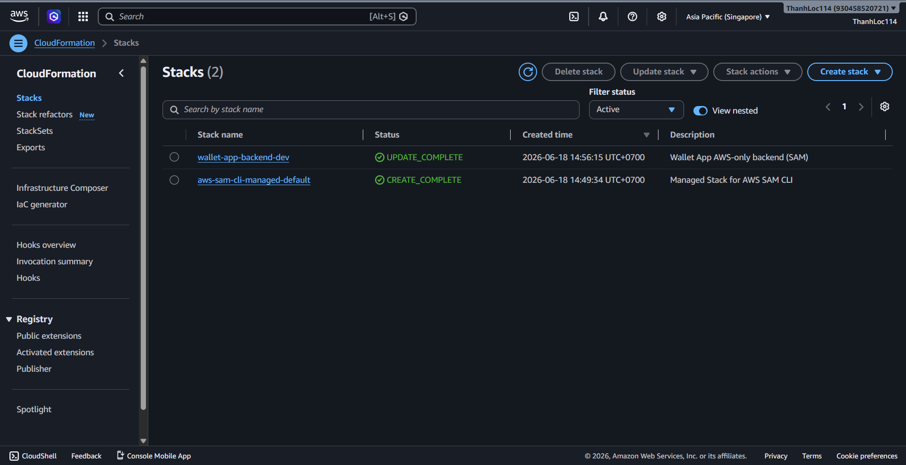
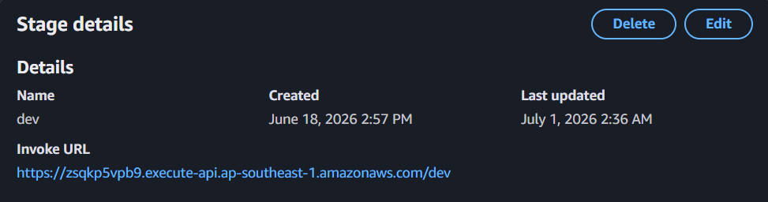
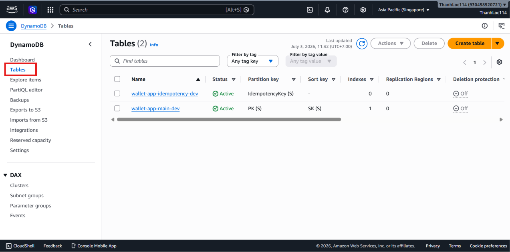
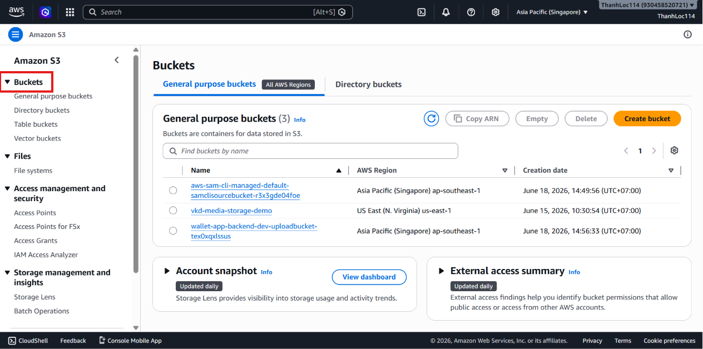
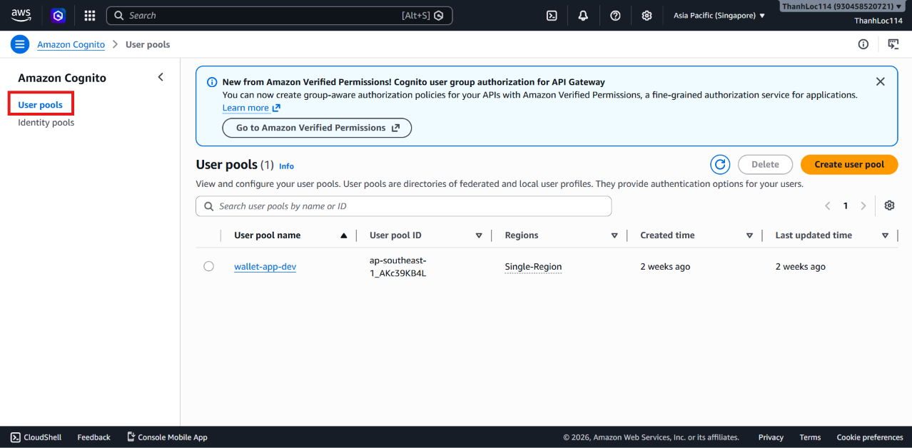
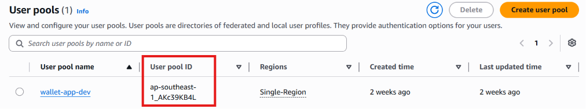
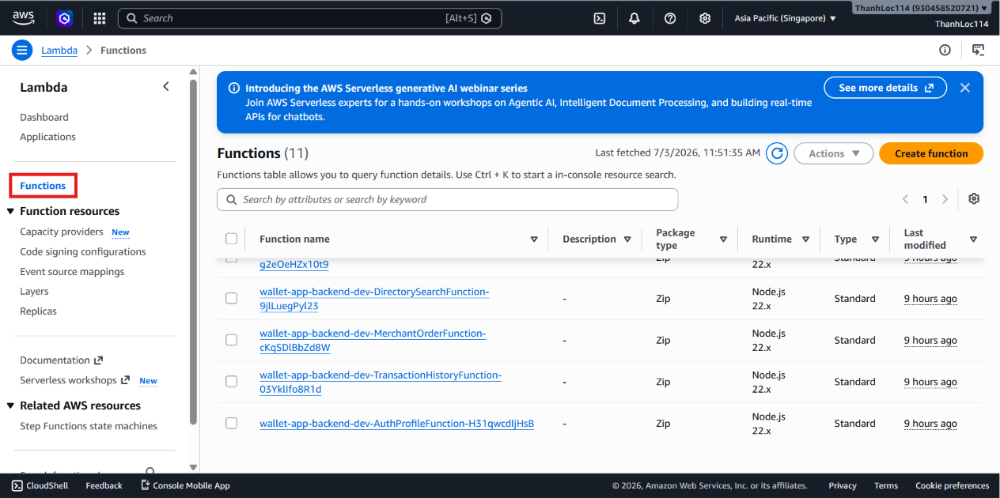
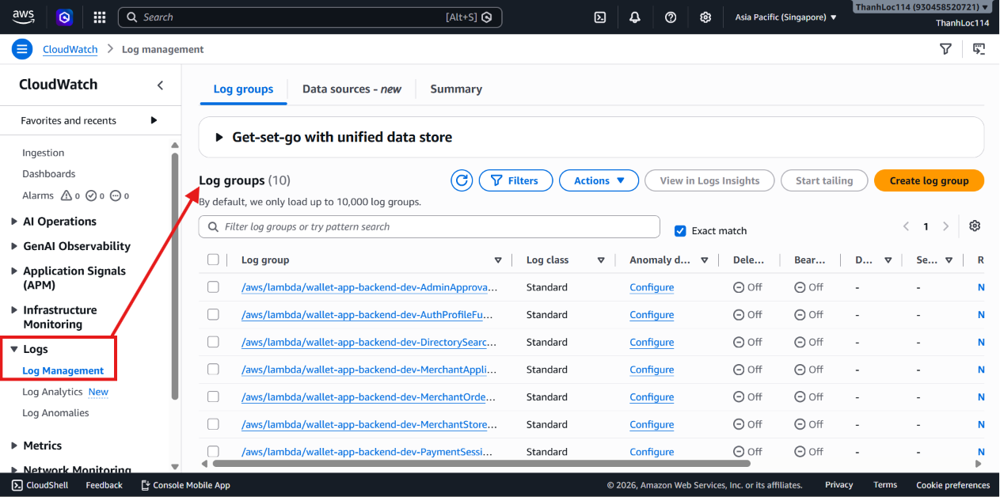
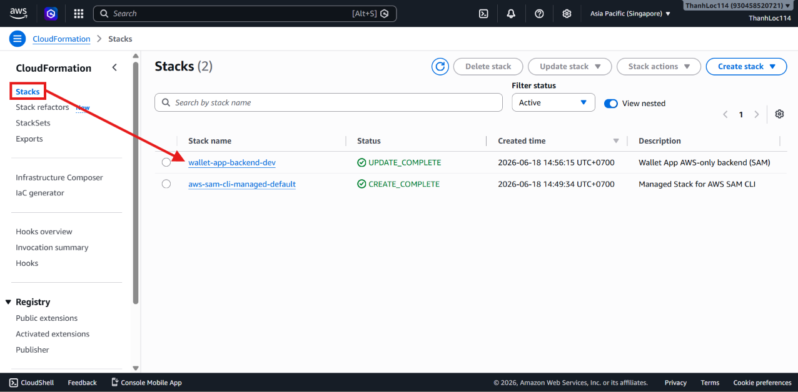
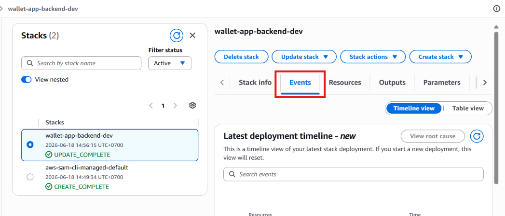

---
title: "Deploy AWS BILLO Backend"
date: 2026-06-29
weight: 3
chapter: false
pre: " <b> 5.3. </b> "
---

---

This section explains how to build and deploy the AWS BILLO backend using AWS SAM and AWS CloudFormation.

The deployment process creates the core serverless resources on AWS, including Cognito, API Gateway, Lambda, DynamoDB, S3, CloudWatch Logs, and the associated IAM permissions.

---

## Step 1: Open the Backend Directory

Open PowerShell and navigate to the backend directory:

```powershell
cd C:\Users\admin\source\repos\AWS_BILLO\backend
```

Verify the main backend files:

```powershell
dir
```

Make sure the directory contains the following files and folders:

```text
template.yaml
samconfig.toml
package.json
src
tests
```

---

## Step 2: Install Backend Dependencies

Install the Node.js dependencies:

```powershell
npm install
```

This command installs the required packages for the Lambda functions and backend tests.

---

## Step 3: Review the SAM Template

Open the following file in Visual Studio Code:

```text
backend/template.yaml
```

This file defines the AWS resources used by the backend, including:

- Cognito User Pool and App Client
- Cognito User Pool Groups
- API Gateway
- Lambda functions
- DynamoDB Main Table
- DynamoDB Idempotency Table
- S3 Upload Bucket
- CloudWatch Logs
- IAM roles and permissions

The backend infrastructure is managed as Infrastructure as Code (IaC) using AWS SAM and AWS CloudFormation.

---

## Step 4: Build the Backend

Run the following command:

```powershell
sam build
```

This command builds the Lambda functions and prepares the deployment artifacts.

If the build cache causes issues, run:

```powershell
sam build --no-cached
```

Expected output:

```text
Build Succeeded
```

---

## Step 5: Deploy the Backend

Deploy the backend using the existing SAM configuration:

```powershell
sam deploy
```

To deploy more quickly with fewer confirmation prompts, run:

```powershell
sam deploy --no-confirm-changeset --no-fail-on-empty-changeset
```

Expected stack information:

```text
Stack name: wallet-app-backend-dev
Region: ap-southeast-1
```

AWS SAM deploys the backend using AWS CloudFormation.

---

## Step 6: Verify the CloudFormation Stack

After deployment, open the AWS Management Console and navigate to:

```text
CloudFormation > Stacks
```

Locate the stack:

```text
wallet-app-backend-dev
```

Verify that the stack status is:

```text
CREATE_COMPLETE
```

or

```text
UPDATE_COMPLETE
```



If the stack deployment fails, open the **Events** tab to identify the resource that caused the failure.

---

## Step 7: Verify the API Gateway Endpoint

The development API endpoint is:



```text
https://zsqkp5vpb9.execute-api.ap-southeast-1.amazonaws.com/dev
```

This endpoint is used by both the Flutter frontend and the Admin Web application to access the backend APIs.

The endpoint should also be configured in:

```text
frontend/config/dev.json
```

---

## Step 8: Verify the DynamoDB Tables

Open the AWS Management Console and navigate to:

```text
DynamoDB > Tables
```



Verify the main table:

```text
wallet-app-main-dev
```

The main table stores data such as:

- User profiles
- Wallets
- Merchant applications
- Stores
- Products or services
- Tables
- Orders
- Bills
- Payment sessions
- Transactions

The project also uses a DynamoDB-based idempotency design to prevent duplicate processing during money transfers and payment operations.

---

## Step 9: Verify the S3 Bucket

Open:

```text
Amazon S3 > Buckets
```



Verify that the upload bucket created by the backend stack exists.

The S3 bucket stores:

- Business registration documents
- Store images
- Product or service images

Files are uploaded using pre-signed URLs generated by the backend.

---

## Step 10: Verify the Cognito User Pool

Open:

```text
Amazon Cognito > User pools
```



Verify the User Pool ID:

```text
ap-southeast-1_AKc39KB4L
```



The User Pool handles:

- Phone number registration
- OTP verification
- User sign-in
- JWT token issuance
- User groups for Customer, Merchant, and Admin

**Important:** SMS OTP delivery depends on your AWS SMS sandbox or production SMS configuration. If your AWS account is still in SMS sandbox mode, only verified phone numbers can receive OTP messages.

---

## Step 11: Verify Lambda Functions and CloudWatch Logs

Open:

```text
AWS Lambda > Functions
```



Verify that all backend Lambda functions have been created successfully.

Then open:

```text
CloudWatch > Log groups
```



Verify the Lambda log groups. These logs are useful for debugging API errors, authentication issues, payment failures, and data validation errors.

---

## Common Deployment Issues

### AWS Credentials Are Not Configured

Run:

```powershell
aws configure
```

Then verify the credentials:

```powershell
aws sts get-caller-identity
```

### SAM Build Fails

Try rebuilding without using the cache:

```powershell
sam build --no-cached
```

Also verify your Node.js version:

```powershell
node -v
```

### CloudFormation Stack Rolls Back

Open:

```text
CloudFormation > Stacks > wallet-app-backend-dev > Events
```





Review the failed event and fix the corresponding resource configuration or IAM permissions.

### OTP Messages Are Not Received

If Cognito SMS is still operating in sandbox mode, use a verified phone number or configure AWS Production SMS access.

---

## Expected Outcome

After completing this section:

- The backend stack has been deployed successfully.
- Cognito, API Gateway, Lambda, DynamoDB, S3, and CloudWatch Logs are fully operational.
- The API Gateway endpoint is available for both the Flutter application and the Admin Web application.
- The project is ready for authentication configuration and application testing.