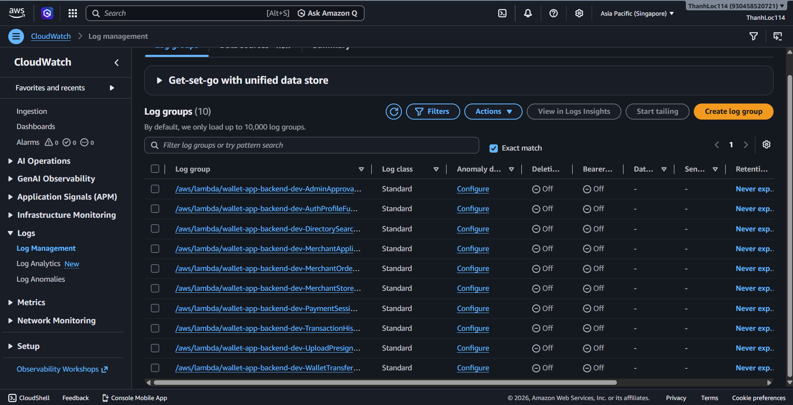
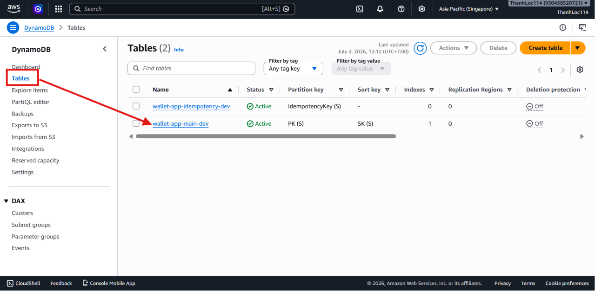
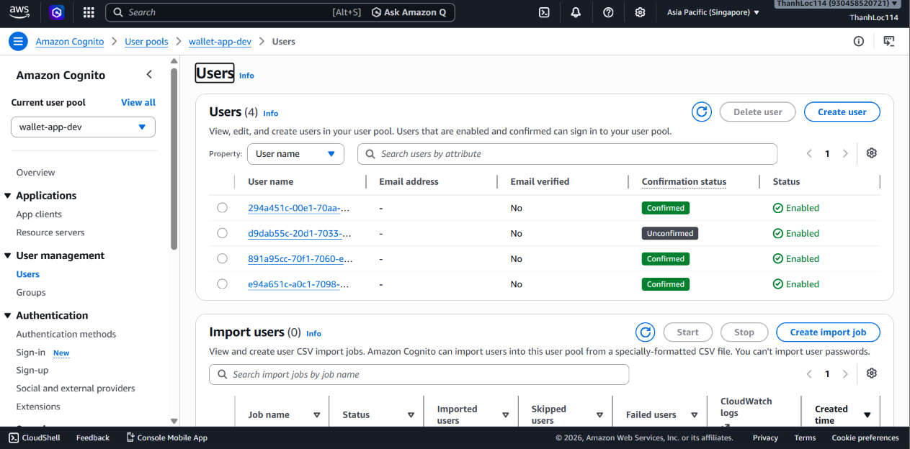
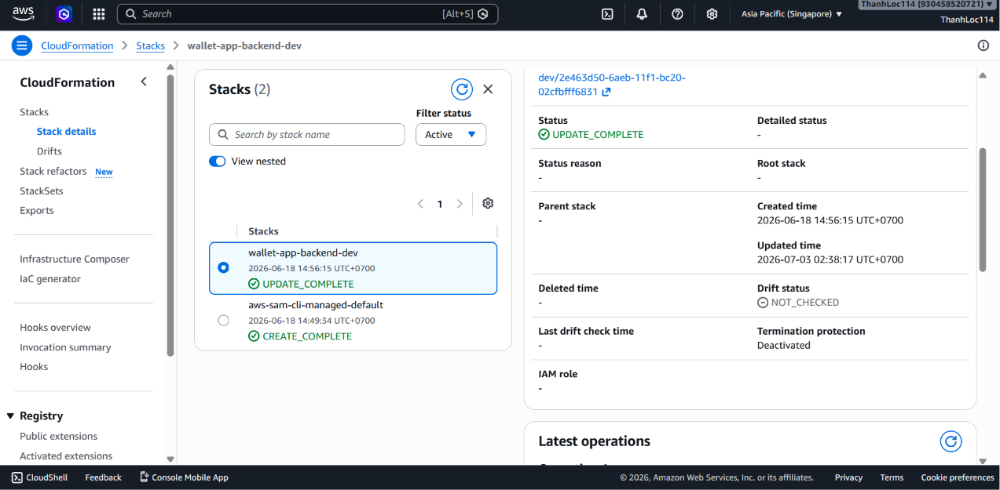
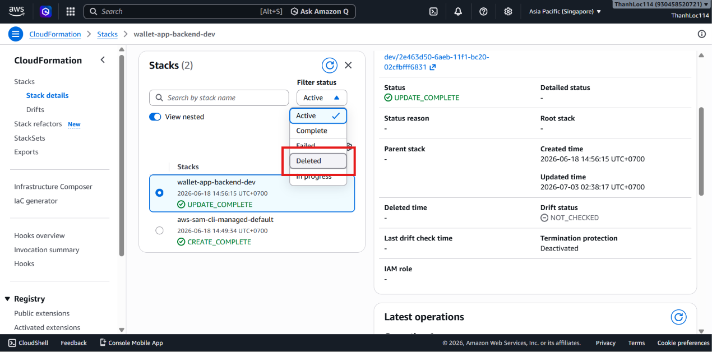
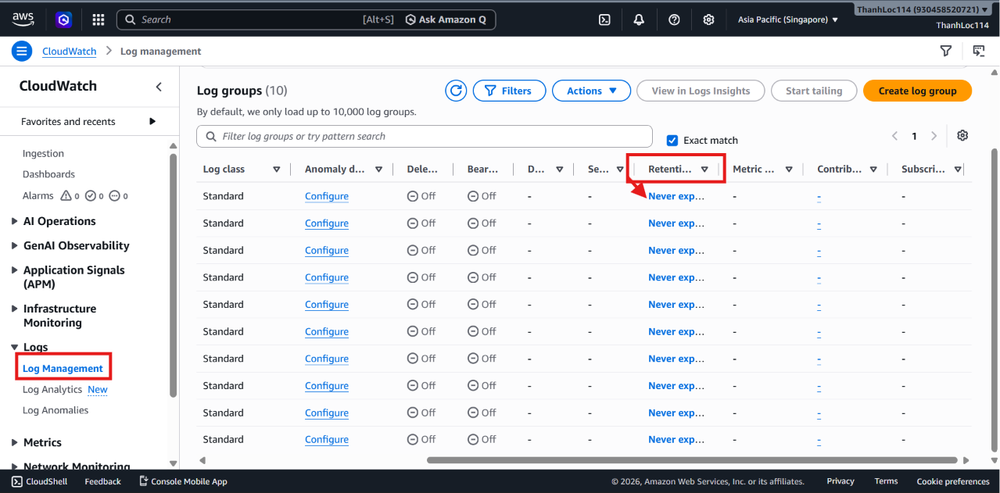
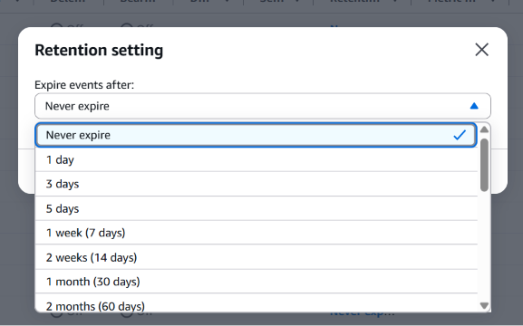

---
title: "Monitoring and Resource Cleanup"
date: 2026-06-29
weight: 8
chapter: false
pre: " <b> 5.8. </b> "
---

---

This section explains how to monitor the AWS BILLO backend and clean up AWS resources after completing the workshop.

Monitoring is essential because the backend runs on serverless services such as API Gateway, Lambda, DynamoDB, S3, and Cognito. When issues occur, CloudWatch Logs and the AWS Management Console can help identify the root cause.

Resource cleanup is equally important to avoid unnecessary AWS charges after testing.

---

## 1. Monitoring with CloudWatch Logs

AWS BILLO uses Amazon CloudWatch Logs to monitor backend activity and troubleshoot Lambda and API issues.

CloudWatch Logs can help you inspect:

- Lambda execution results
- API request errors
- Authentication issues
- DynamoDB read/write errors
- S3 upload failures
- Payment and transaction errors
- Business registration workflow errors

---

## Step 1: Open CloudWatch Logs

Open the AWS Management Console and navigate to:

```text
CloudWatch > Logs > Log groups
```



Locate the log groups associated with the AWS BILLO Lambda functions.

Lambda log groups typically follow this format:

```text
/aws/lambda/<function-name>
```

---

## Step 2: Open a Lambda Log Group

Select one of the Lambda log groups.

Then open the most recent log stream.

A typical log stream contains entries such as:

```text
START RequestId
Function logs
Error messages
END RequestId
REPORT RequestId
```

These logs help determine whether the Lambda function executed successfully or encountered errors.

---

## Step 3: Troubleshoot API Errors

If the frontend receives an API error, check the corresponding Lambda logs in CloudWatch.

Common API errors include:

| Error | Possible Cause |
|-------|----------------|
| `401 Unauthorized` | Missing, expired, or invalid JWT token |
| `403 Forbidden` | The user does not have the required permissions |
| `400 Bad Request` | Missing or invalid request data |
| `404 Not Found` | Incorrect API path or requested record does not exist |
| `500 Internal Server Error` | Lambda error, DynamoDB error, or an unhandled exception |

When troubleshooting, verify:

- API Gateway endpoint
- Request payload
- JWT token
- Lambda function logs
- DynamoDB records
- User role in Cognito

---

## Step 4: Verify DynamoDB Data

Open:

```text
DynamoDB > Tables > wallet-app-main-dev
```



Verify that the expected records were created during the demonstration.

Important record types may include:

- User profile
- Wallet
- Merchant application
- Store
- Product or service
- Table
- Order
- Bill
- Payment session
- Transaction

If a feature does not work as expected, compare the expected data with the actual records stored in DynamoDB.

---

## Step 5: Verify Uploaded Files in S3

Open:

```text
Amazon S3 > Buckets
```

Locate the upload bucket created by the backend stack.

Verify uploaded files such as:

- Business registration documents
- Store images
- Product or service images

If uploads fail, check:

- Whether the pre-signed URL was generated successfully
- S3 bucket permissions
- File type and file size
- Browser console errors
- Lambda logs in CloudWatch

---

## Step 6: Verify Cognito Users and Groups

Open:

```text
Amazon Cognito > User pools > Users
```



Verify the user accounts created during the demonstration.

Confirm that:

- The user exists.
- The user status is **Confirmed**.
- The phone number is correct.
- The user belongs to the appropriate group.

For approved merchants, verify that the user belongs to the:

```text
Merchant
```

group.

For administrator accounts, verify membership in the:

```text
Admin
```

group.

---

## Step 7: Verify the CloudFormation Stack

Open:

```text
CloudFormation > Stacks
```

Locate the stack:

```text
wallet-app-backend-dev
```

Verify its status.

Typical successful statuses include:

```text
CREATE_COMPLETE
UPDATE_COMPLETE
```



If the deployment fails, open the **Events** tab to identify the resource that caused the failure.

---

## 2. Cleaning Up AWS Resources

After completing the workshop, remove the deployed backend resources if they are no longer needed.

Since the backend was deployed using AWS SAM, resources can be removed using either AWS SAM or AWS CloudFormation.

---

## Option 1: Delete Resources Using AWS SAM

Open PowerShell and navigate to the backend directory:

```powershell
cd C:\Users\admin\source\repos\AWS_BILLO\backend
```

Run:

```powershell
sam delete
```

AWS SAM will prompt for confirmation before deleting the stack.

Expected result:

- The CloudFormation stack is deleted.
- Resources managed by the stack are removed.
- Backend resources such as Lambda, API Gateway, DynamoDB, S3, and Cognito may be deleted, depending on the stack configuration.

---

## Option 2: Delete the Stack from the AWS Console

Open:

```text
CloudFormation > Stacks
```

Select:

```text
wallet-app-backend-dev
```

Choose:

```text
Delete
```



Confirm the deletion.

Expected result:

- CloudFormation begins deleting the stack.
- The stack status changes to `DELETE_IN_PROGRESS`.
- Once completed, the stack disappears from the console.

---

## Important Cleanup Considerations

Before deleting resources, ensure that any required test data has been backed up or is no longer needed.

Some resources may contain important demonstration data, including:

- User accounts in Cognito
- Wallets and transaction records in DynamoDB
- Business registration documents and product images stored in S3
- Lambda logs in CloudWatch

If the project is still under development, it is recommended to keep the backend stack and remove only unnecessary test data.

---

## Optional: Remove Only Test Data

If you want to keep the backend infrastructure while removing test data, manually delete test records from:

```text
DynamoDB > Tables > wallet-app-main-dev
```

You can also remove uploaded test files from:

```text
Amazon S3 > Buckets
```

Be careful when deleting data, as it may affect demo users and existing testing workflows.

---

## Optional: Configure CloudWatch Log Retention

CloudWatch Logs may continue storing logs after testing is complete.

To reduce storage costs, configure log retention:

```text
CloudWatch > Logs > Log groups > Select log group > Retention settings
```



Recommended retention periods for development environments:

```text
7 days
14 days
30 days
```



Avoid retaining development logs indefinitely unless required.

---

## Optional: Configure AWS Budget Alerts

To help prevent unexpected AWS charges, configure an AWS Budget.

Open:

```text
Billing and Cost Management > Budgets
```

Create a monthly cost budget.

Example configuration:

```text
Budget amount: 5 USD
Alert threshold: 80%
Email notification: your email address
```

This helps detect unexpected costs from services such as SMS, CloudWatch Logs, S3 storage, or API usage.

---

## Common Cleanup Issues

### Stack Deletion Fails

Possible causes include:

- The S3 bucket is not empty.
- DynamoDB deletion protection is enabled.
- Insufficient IAM permissions.
- A resource has been modified manually outside CloudFormation.

Review the CloudFormation **Events** tab to identify the failing resource.

### Unable to Delete the S3 Bucket

If the bucket is not empty, delete all objects inside the bucket first.

Then rerun `sam delete` or delete the stack from CloudFormation.

### Resources Still Appear After Deletion

Some AWS resources may take several minutes to disappear from the console.

Refresh the AWS Management Console and review the CloudFormation stack events.

---

## Expected Outcome

After completing this section:

- You can inspect Lambda logs using CloudWatch.
- You can verify application data stored in DynamoDB.
- You can review uploaded files stored in S3.
- You can verify users and groups in Cognito.
- You can remove the backend stack using AWS SAM or CloudFormation.
- You can minimize unnecessary AWS costs after completing the workshop.