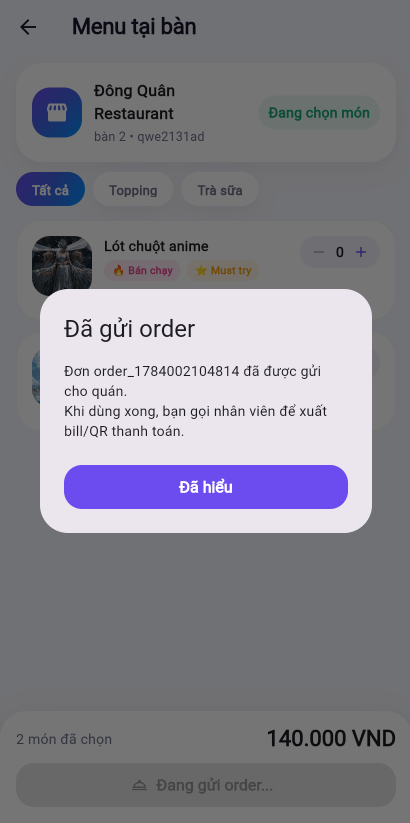

---

This section presents in detail each function available to the Customer role in AWS BILLO, including actual operation steps, expected results, and illustrative images from the deployed demo at https://dev.d28z1hw6wfvjzy.amplifyapp.com.

---

## 1. Sign Up / Log In

Customers register an account using a phone number and password, confirmed via an OTP sent by Cognito/SNS.

Steps:

- Open the sign-up screen on the Flutter app.
- Enter the phone number (e.g. `0853555443`, which the system automatically converts to `+84853555443`).
- Enter a password.
- Receive the OTP code via SMS.
- Enter the OTP to confirm the account.
- Log in with the newly created account.

Expected results:

- A user is created in Amazon Cognito with `CONFIRMED` status.
- A profile and simulated wallet are created in DynamoDB.
- The app opens the Customer interface after logging in.

Related components: Amazon Cognito, Amazon SNS.

---

## 2. Set Transaction PIN

After the first login, the Customer needs to set a 6-digit PIN used to confirm money transactions.

Steps:

- Go to the Personal tab.
- Select Set Transaction PIN.
- Enter a 6-digit PIN (e.g. `123456`).
- Re-enter the PIN to confirm.
- Save.

Expected results:

- The PIN is stored (encrypted) in the system, linked to the Customer's profile.
- The PIN is required for all subsequent money transactions: transfers, QR payments.

Related components: Amazon Cognito (profile), DynamoDB Main Table.

---

## 3. Wallet and Transaction History

Customers can view their current wallet balance and the full history of transactions they've made.

Steps:

- Go to Home to view the wallet balance.
- Go to the History tab to view the list of transactions.
- Tap a transaction to view details (amount, time, description, status).

Expected results:
- The balance displays correctly and updates in real time after each transaction.
- History is displayed in correct chronological order, most recent at the top.
- Transaction details display full related information.

Related components: DynamoDB Main Table (wallet, transaction).

---

## 4. Transfer Money

Users can transfer money to another party using a phone number, wallet ID, or QR code.

Steps:

- Go to Home, tap Transfer Money.
- Enter the recipient's phone number or username, wallet ID, or scan a QR code.
- Enter the amount and a transfer note.
- The app displays a recipient confirmation screen.
- Tap Transfer, then enter the transaction PIN.

Expected results:

- If the PIN is correct and the balance is sufficient: the sender's wallet is debited, the recipient's wallet is credited, and a transaction record is created for both sides.
- If the PIN is incorrect or the balance is insufficient: the transaction is rejected and no money is deducted.
- Pressing the transfer button multiple times in a row (double click) does not duplicate the transaction, thanks to the DynamoDB Idempotency Table.

Related components: DynamoDB Idempotency Table (prevents duplicate transactions).

---

## 5. Scan Table QR and Order Food

Customers scan the QR code at a restaurant table to open the menu and place an order.

Steps:

- Open the Scan QR tab.
- Scan the restaurant table's QR code.
- The app opens the menu for the corresponding restaurant/table.
- Select items/services and adjust quantities.
- Submit the order.

Expected results:

- The Customer is attached to the table's active table session.
- The order is stored in DynamoDB and linked to the table.
- If the table already has an open bill, the new items are merged into the existing bill.
- The Merchant sees the order appear immediately in the merchant business interface.

Related components: DynamoDB Main Table (table, order).

---

## 6. Pay Bill via QR

Customers pay their bill by scanning a payment QR code generated by the Merchant.

Steps:

- Open the payment bill (scan the QR code generated by the Merchant).
- Check the information: restaurant name, list of items, total amount, bill status.
- Tap Transfer Money.
- Enter the transaction PIN to confirm.

Expected results:

- If the bill is still valid and the wallet has sufficient balance: the Customer's wallet is debited, the Merchant's wallet is credited, the order and payment session are marked complete, and the active table is removed from the Customer's account.
- If the bill status is `EXPIRED`: the Transfer button is locked, and the Merchant needs to generate a new payment QR code.

Related components: DynamoDB (payment session, transaction).

---

## Common Issues

| Situation | Possible Cause |
|---|---|
| OTP not received | Cognito/SMS is in sandbox mode, phone number not yet verified |
| Transfer/payment failed | Incorrect PIN, insufficient balance, expired bill/QR code |
| Unable to scan table QR | Browser has not granted camera permission, app is not running on HTTPS/localhost, invalid QR code |

---

## Overall Expected Results

After completing this section, the main functions of the Customer role have been fully tested: sign-up/login, PIN setup, wallet viewing, money transfer, ordering via table QR, and bill payment via QR — all working correctly on the deployed demo.