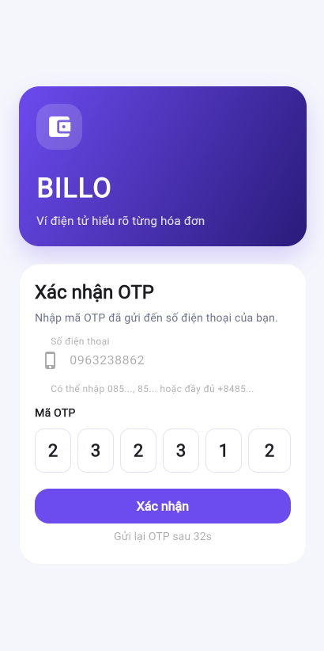
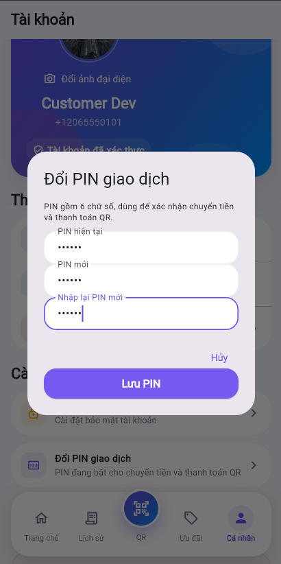
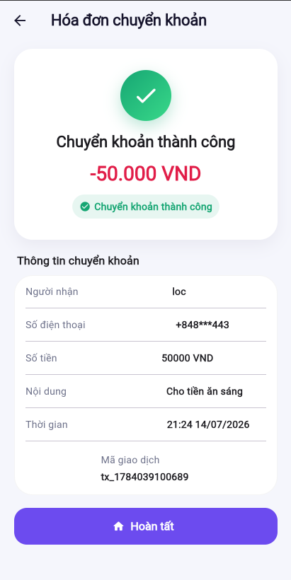
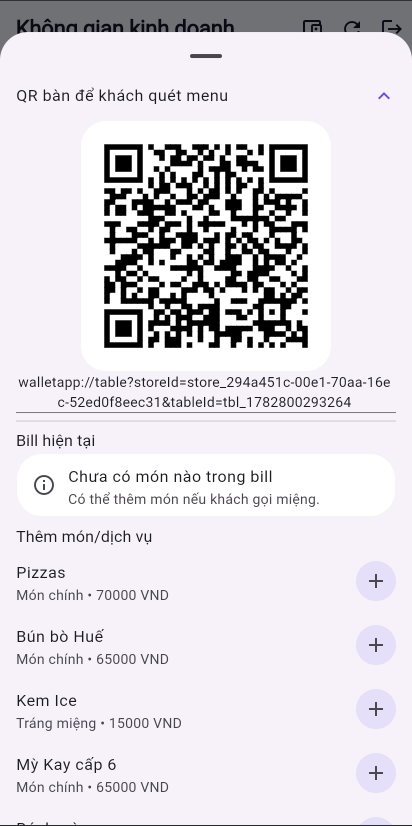
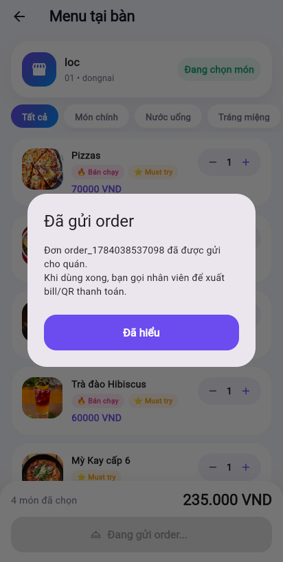
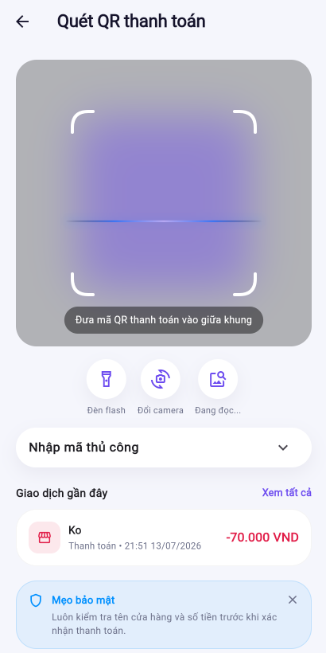

---

Phần này trình bày chi tiết từng chức năng dành cho vai trò Customer trong AWS BILLO, kèm bước thao tác thực tế, kết quả mong đợi và ảnh minh họa từ bản demo đã deploy tại https://dev.d28z1hw6wfvjzy.amplifyapp.com.

---

## 1. Đăng ký / Đăng nhập

Customer đăng ký tài khoản bằng số điện thoại và mật khẩu, xác nhận qua OTP do Cognito/SNS gửi.

Các bước thao tác:

- Mở màn hình đăng ký trên Flutter app.
- Nhập số điện thoại (ví dụ `0853555443`, hệ thống tự hiểu thành `+84853555443`).
- Nhập mật khẩu.
- Nhận mã OTP qua SMS.
- Nhập OTP để xác nhận tài khoản.
- Đăng nhập bằng tài khoản vừa tạo.

Kết quả mong đợi:

- User được tạo trong Amazon Cognito với trạng thái `CONFIRMED`.
- Profile và ví mô phỏng được tạo trong DynamoDB.
- Ứng dụng mở giao diện Customer sau khi đăng nhập.

Chức năng liên quan: Amazon Cognito, Amazon SNS.

---

## 2. Đặt PIN giao dịch

Sau khi đăng nhập lần đầu, Customer cần đặt PIN 6 số dùng để xác nhận các giao dịch tiền.

Các bước thao tác:

- Vào tab Cá nhân.
- Chọn Đặt PIN giao dịch.
- Nhập PIN 6 số (ví dụ `123456`).
- Xác nhận lại PIN.
- Lưu lại.

Kết quả mong đợi:

- PIN được lưu (mã hóa) trong hệ thống, gắn với profile Customer.
- PIN được yêu cầu ở mọi giao dịch tiền sau đó: chuyển tiền, thanh toán QR.

Chức năng liên quan: Amazon Cognito (profile), DynamoDB Main Table.

---

## 3. Ví và lịch sử giao dịch

Customer xem số dư ví hiện tại và toàn bộ lịch sử giao dịch đã thực hiện.

Các bước thao tác:

- Vào Trang chủ để xem số dư ví.
- Vào tab Lịch sử để xem danh sách giao dịch.
- Bấm vào một giao dịch để xem chi tiết (số tiền, thời gian, nội dung, trạng thái).

Kết quả mong đợi:
- Số dư hiển thị đúng, cập nhật real-time sau mỗi giao dịch.
- Lịch sử hiển thị đúng thứ tự thời gian, mới nhất ở trên.
- Chi tiết giao dịch hiển thị đầy đủ thông tin liên quan.

Chức năng liên quan: DynamoDB Main Table (wallet, transaction).

---

## 4. Chuyển tiền

Người dùng chuyển tiền cho một bên khác bằng số điện thoại, mã ví, QR.

Các bước thao tác:

- Vào Trang chủ, bấm Chuyển tiền.
- Nhập số điện thoại hoặc user nhận, mã ví, quét QR.
- Nhập số tiền và nội dung chuyển tiền.
- App hiện màn hình xác nhận người nhận.
- Bấm Chuyển tiền, nhập PIN giao dịch.

Kết quả mong đợi:

- Nếu đúng PIN và đủ số dư: ví người gửi bị trừ, ví người nhận được cộng, transaction record được tạo cho cả hai phía.

- Nếu sai PIN hoặc không đủ số dư: giao dịch bị từ chối, không có tiền bị trừ.
- Bấm nút chuyển tiền nhiều lần liên tiếp (double click) không làm giao dịch bị lặp, nhờ DynamoDB Idempotency Table.

Chức năng liên quan: DynamoDB Idempotency Table (chống trùng giao dịch).

---

## 5. Quét QR bàn và gọi món

Customer quét QR tại bàn của quán để mở menu và đặt món.

Các bước thao tác:

- Mở tab Quét QR.
- Quét QR bàn của quán.
- App mở menu của quán/bàn tương ứng.
- Chọn món/dịch vụ, điều chỉnh số lượng.
- Gửi order.

Kết quả mong đợi:

- Customer được gắn vào active table session của bàn đó.
- Order được lưu trong DynamoDB và liên kết với bàn.
- Nếu bàn đã có bill đang mở, món mới được gộp vào bill hiện tại.
- Merchant thấy order xuất hiện ngay trong giao diện kinh doanh.

Chức năng liên quan: DynamoDB Main Table (table, order).

---

## 6. Thanh toán hóa đơn QR

Customer thanh toán hóa đơn bằng cách quét QR thanh toán do Merchant tạo.

Các bước thao tác:

- Mở hóa đơn thanh toán (quét QR do Merchant tạo).
- Kiểm tra thông tin: tên quán, danh sách món, tổng tiền, trạng thái hóa đơn.
- Bấm Chuyển tiền.
- Nhập PIN giao dịch để xác nhận.

Kết quả mong đợi:

- Nếu hóa đơn còn hạn và ví đủ tiền: ví Customer bị trừ, ví Merchant được cộng, order và payment session được đánh dấu hoàn tất, active table được xóa khỏi tài khoản Customer.
- Nếu hóa đơn ở trạng thái `EXPIRED`: nút chuyển tiền bị khóa, Merchant cần tạo lại QR thanh toán mới.

Chức năng liên quan: DynamoDB (payment session, transaction).

---

## Lỗi thường gặp

| Tình huống | Nguyên nhân có thể |
|---|---|
| Không nhận được OTP | Cognito/SMS đang ở sandbox mode, số điện thoại chưa được verify |
| Chuyển tiền/thanh toán thất bại | Sai PIN, không đủ số dư, hóa đơn/QR đã hết hạn |
| Không quét được QR bàn | Trình duyệt chưa cấp quyền camera, app không chạy trên HTTPS/localhost, QR không hợp lệ |

---

## Kết quả mong đợi chung

Sau khi hoàn thành phần này, các chức năng chính của vai trò Customer đã được kiểm tra đầy đủ: đăng ký/đăng nhập, đặt PIN, xem ví, chuyển tiền, gọi món qua QR bàn, và thanh toán hóa đơn QR — tất cả hoạt động đúng trên bản demo đã deploy.