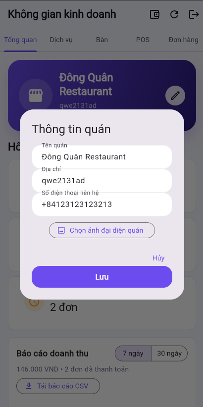
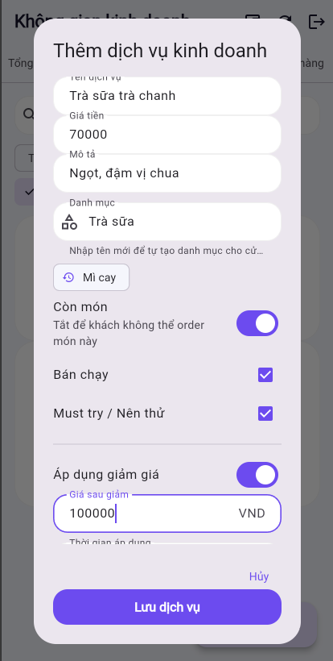
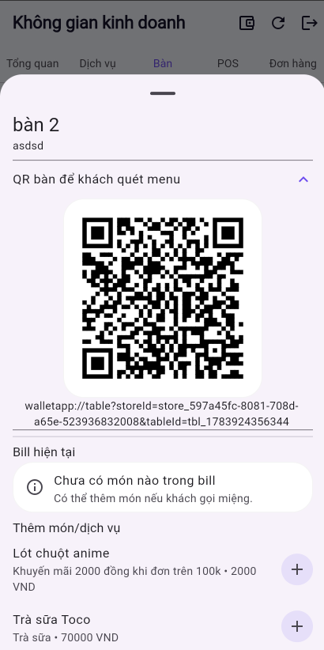
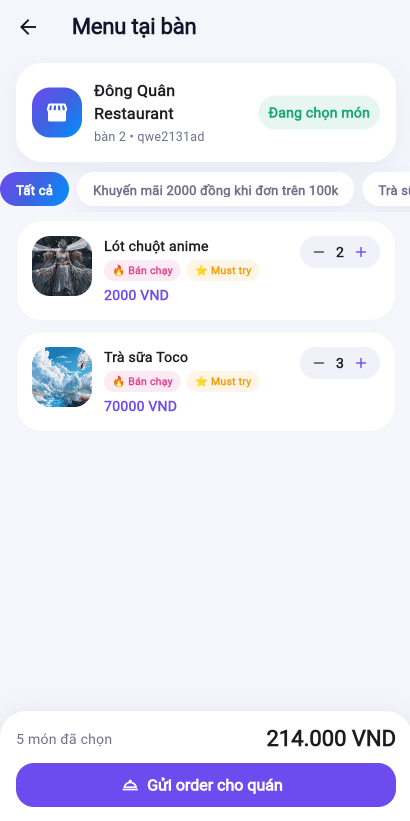
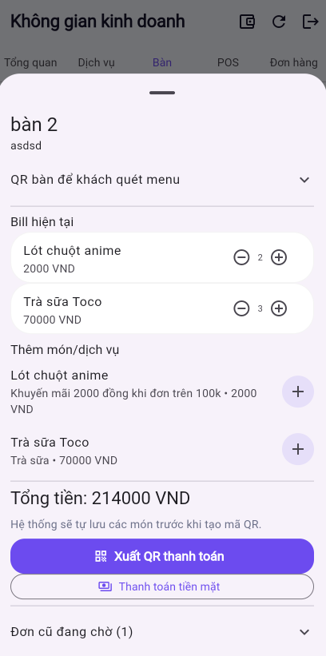
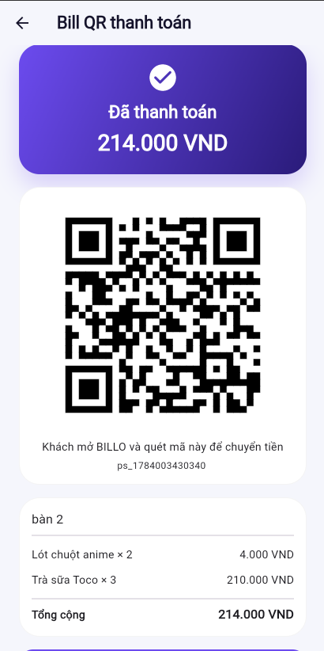
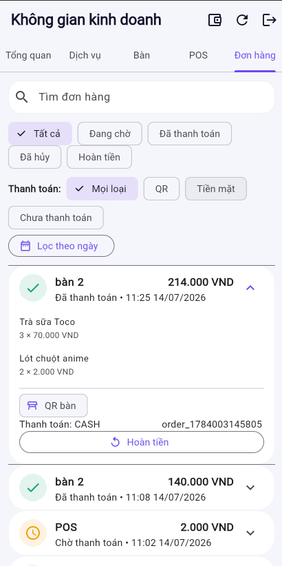

---

This section presents in detail each function available to the Merchant role in AWS BILLO, including actual operation steps, expected results, and illustrative images from the deployed demo at https://dev.d28z1hw6wfvjzy.amplifyapp.com.

A Merchant is a Customer whose business profile has been approved by an Admin and who has been granted additional permissions to manage a store.

---

## 1. Business Registration

From a Customer account, users submit a business registration application to become a Merchant.

Steps:

- Log in with a Customer account.
- Go to the Personal tab, select Business Registration.
- Enter the information:
  - Business owner's full name.
  - Store/business name.
  - Contact phone number.
  - National ID (CCCD).
  - Business address.
  - Business license photo.
- Upload the business license photo.
- Submit the application for review.

Expected results:

- The app requests a pre-signed URL from the backend to upload the photo.
- The photo is stored in Amazon S3.
- The registration application is stored in DynamoDB with `PENDING` status.
- The application appears in the Admin's pending-approval list.
- The user waits for Admin review and does not yet have Merchant permissions at this stage.

Related components: Amazon S3 (document upload via pre-signed URL), DynamoDB Main Table.

---

## 2. Business Workspace

After the Admin approves the application, the Merchant gains access to a dedicated store management area.

Steps:

- After approval, log out and log back in (so the app picks up the new Cognito group).
- Go to the Merchant interface / Business Workspace.
- Check the displayed tabs: Overview, Services, Tables, POS, Orders.

Expected results:

- The user is added to the `Merchant` Cognito group.
- A store record is created for the Merchant.
- The Merchant interface displays all 5 management tabs.
- If the Merchant interface is not yet visible, the user needs to log out/log back in for the app to reload the group information.

Related components: `Merchant` Cognito User Group, DynamoDB Main Table (store).

### 2.1. Update Store Information

In the Overview tab, the Merchant can update:

- Store name.
- Address.
- Avatar/store photo.
- Operating status (on/off).

Expected results: the store information is updated in DynamoDB and immediately reflected on the Customer-facing menu. If the Merchant turns off the operating status, Customers will no longer be able to place orders, even if they scan the correct table QR code.

---

## 3. Category and Product/Service Management

Merchants organize the menu by category, add products/services, and configure discounts.

Steps — create a category:

- Go to the Services tab.
- Create a new category, e.g.: Milk Tea, Drinks, Snacks.

Steps — add a product/service:

- Add a new item/service with: name, price, photo, category.
- Mark as Best Seller / Must Try if applicable.
- Select status: on sale or temporarily hidden.
- Save and verify the item displays correctly in the customer menu.

Steps — configure a discount:

- Go to edit the item/service to be discounted.
- Enter the original price, discounted price, and displayed discount percentage.
- Set a start/end time, or the applicable time window/days of the week.
- Save.

Expected results:

- Categories and products are stored in DynamoDB, and product photos are uploaded to S3 via a pre-signed URL.
- Hidden products do not appear in the Customer menu.
- During the discount period, Customers see the correct discounted price and percentage; outside that period, the price automatically reverts to the original price.

Related components: DynamoDB Main Table, Amazon S3 (product photos).

---

## 4. Table and Table QR Management

Merchants create tables for their store, and the system generates a unique QR code for each table.

Steps:

- Go to the Tables tab, tap Add Table.
- Enter the table name/number, and area/floor if applicable.
- The system automatically generates a QR code for the newly created table.
- Tap a table to view details: the table's QR code, current order, items the customer has ordered.
- Download the table QR code, print it, and place it on the physical table for Customers to scan.

Expected results:

- The table is stored in DynamoDB.
- The generated QR code can be scanned by Customers to open the correct store menu for that exact table.
- Deleting a table that has an open order needs to be handled carefully (a warning should be shown, or deletion should be blocked, if the table still has an open bill).

Related components: DynamoDB Main Table (table).

---

## 5. Receiving Orders and Processing Bills

Merchants track each table's orders in real time and can edit the bill before payment.

Steps:

- The Customer scans the table QR code and submits an order.
- The Merchant goes to the Tables tab and taps the corresponding table.
- View the pending order: items, quantities, current subtotal.
- If needed, the Merchant can:
  - Add an item if the customer ordered verbally.
  - Remove an item if the customer changed their mind.
  - Adjust quantities.
  - Save the updated bill.

(When the customer places an order)

(The order is sent to the table)

Expected results:

- New orders from Customers appear almost instantly in the Merchant interface.
- The bill correctly displays the current list of items, quantities, and total amount.
- Any changes to the bill (add/remove/edit) are saved before generating the payment QR code, ensuring the QR reflects the correct final amount.

Related components: DynamoDB Main Table (order, bill).

---

## 6. Payment

Merchants have two ways to close out an order: payment via QR/wallet or cash.

### 6.1. QR/Wallet Payment

Steps:

- In the table or order details, tap Generate Payment QR.
- Show the QR code for the Customer to scan with the app.
- The Customer confirms payment with their PIN.
- The Merchant watches the order status change to paid.

### 6.2. Cash Payment

Steps:

- The Merchant selects the cash payment option.
- The order is marked as manually paid.
- The table returns to an empty state, ready for the next customer.

Expected results:

- For QR payment: the backend creates a payment session, the Customer's wallet is debited, the Merchant's wallet is credited, a transaction record is created for both sides, and the payment session is marked complete.
- An existing payment QR code becomes invalid if the bill changes after the QR was generated — the Merchant needs to generate a new QR code.
- After payment (QR or cash), the table is freed up and the active table is removed from the Customer's account.

Related components: DynamoDB (payment session, transaction); the Merchant's wallet is credited.

---

## Common Issues

| Situation | Possible Cause |
|---|---|
| Merchant features don't appear after approval | Did not log out/log back in for the app to pick up the new Cognito group |
| Product photo/business license fails to upload | S3 bucket permissions, error generating the pre-signed URL, invalid file type/size |
| Payment QR code cannot be used | The bill changed after the QR was generated, or the payment session expired |
| Customer's order does not appear in the Merchant interface | API Gateway/Lambda connection error — check CloudWatch Logs |

---

## Overall Expected Results

After completing this section, the main functions of the Merchant role have been fully tested: business registration, store/product/discount management, table and table QR management, real-time order/bill processing, and receiving payment via QR or cash — all working correctly on the deployed demo.