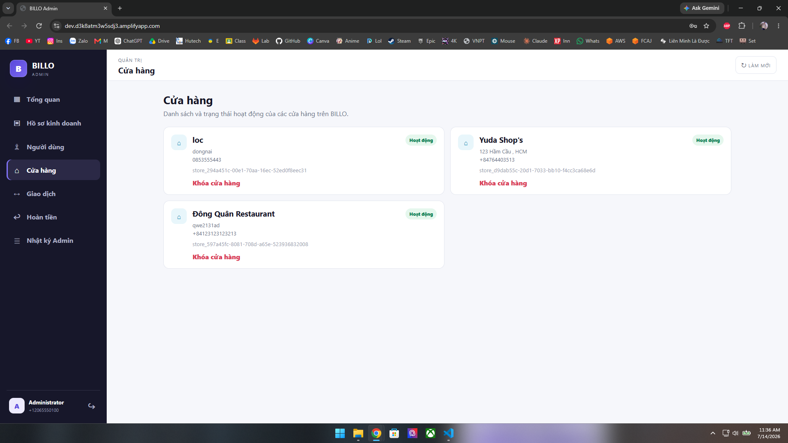
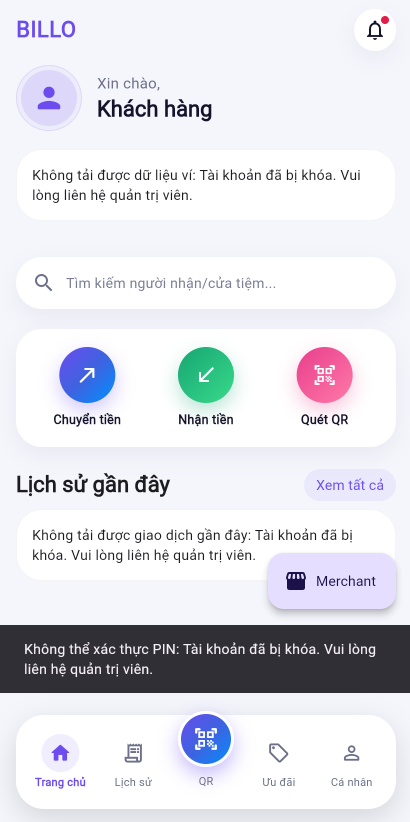

---

This section presents in detail each function available to the Admin role in AWS BILLO, including actual operation steps, expected results, and illustrative images from the deployed demo at https://dev.d3k8atm3w5sdj3.amplifyapp.com

Admin is the system operations role: approving Merchant applications, managing users/stores, monitoring transactions, and processing refunds.

---

## 1. Admin Login

Only accounts belonging to the `Admin` Cognito group can access the Admin Web.

Steps:

- Open the Admin Web at https://dev.d3k8atm3w5sdj3.amplifyapp.com.
- Enter the Admin account's phone number and password.
- Tap Admin Login.

Expected results:

- If the account belongs to the `Admin` group: login succeeds and the user goes directly to the admin dashboard.
- If the account does not belong to the `Admin` group (even a valid Customer/Merchant): access is denied.
- If login fails, check: account credentials, Cognito User Pool configuration, JWT token, errors in the browser console, and the backend's CloudWatch Logs.

Related components: Amazon Cognito (`Admin` User Group).

---

## 2. Overview Dashboard

After logging in, the Admin immediately sees the system's operational status.

Steps:

- View the metrics displayed on the dashboard:
  - Number of Merchant applications pending approval.
  - Number of stores.
  - Number of users.
  - Recent transactions.
  - Refunds pending processing.
  - Operational status: pending applications, deactivated stores, locked accounts.

Expected results:

- The figures on the dashboard match the actual data in DynamoDB.
- The Admin can use the dashboard to quickly spot items that need attention (pending applications, refunds awaiting processing) without going into each section individually.
- Detailed technical logs (Lambda, API) are not displayed here — the Admin Web only shows business data; technical logs are still viewed in AWS CloudWatch.

Related components: DynamoDB Main Table.

---

## 3. Approve / Reject Merchant Applications

The Admin reviews business registration applications submitted by Customers.

Steps — view an application:

- Go to the Merchant Applications section.
- Select an application with `PENDING` status.
- View the details: business owner, store name, National ID (CCCD), phone number, business license photo.

Steps — approve an application:

- Tap Approve.

Steps — reject an application:

- Tap Reject.
- Enter a reason for rejection, if applicable.

Expected results when Approved:

- The application status changes to `APPROVED`.
- The user is added to the `Merchant` group in Cognito.
- A store record is created for the Merchant.
- The Merchant needs to log back in on the Flutter app to see the business interface.

Expected results when Rejected:

- The application status changes to `REJECTED`.
- The user is not added to the `Merchant` group and has no access to business features.

Related components: Amazon Cognito (`Merchant` User Group), DynamoDB Main Table.

---

## 4. User and Store Management

The Admin monitors and can intervene in user accounts as well as store operational status.

### 4.1. User Management

Steps:

- Go to the user list.
- Check the account's information and current role (customer/merchant/admin).
- Lock/unlock an account if the feature is enabled.

 

### 4.2. Revoke Merchant Permissions

Steps:

- Go to the user/merchant whose permissions need to be revoked.
- Tap Revoke Merchant Permissions.

Expected results:

- The user is removed from the `Merchant` group in Cognito.
- The profile reverts to customer.
- The corresponding store is deactivated.
- Transaction history is preserved intact and not deleted.
- The system records an audit log entry for the revocation action.

### 4.3. Store Management

Steps:

- Go to the store list.
- View the status of each store.
- Enable/disable operational status as needed.

Expected results: when a store is deactivated (inactive), Customers can no longer place orders, even though the table QR code can still be scanned.

Related components: Amazon Cognito (User Group), DynamoDB Main Table.

---

## 5. Admin Logs and Refunds

Admin logs allow monitoring of the entire system's activity, and this section also covers processing refund requests.

### 5.1. View Admin Logs

Steps:

- Go to the "Admin Logs" section.
- View the detailed list of actions, targets, and dates.

### 5.2. Process Refunds

Steps:

- Go to the "Refunds" section.
- View refund requests pending processing.
- Approve or reject the request.

Expected results when a refund is Approved:

- The system deducts money from the Merchant's wallet.
- Money is credited back to the Customer's wallet.
- The status of the related order/transaction is updated to refunded.
- Approving the same request twice in a row must not cause the refund to be issued twice.

Expected results when a refund is Rejected: no money moves between wallets, and the request status is updated to rejected.

Related components: DynamoDB Main Table (transaction, refund).

---

## Common Issues

| Situation | Possible Cause |
|---|---|
| Admin login fails | Incorrect account credentials, user not in the `Admin` group, incorrect Cognito/API configuration |
| Merchant application status not updating | API Gateway request error, Lambda error, insufficient permissions to update the Cognito group |
| Dashboard figures don't match actual data | DynamoDB data not yet synced — check Lambda logs in CloudWatch |
| Refund does not correctly update the balance | DynamoDB transaction error — check CloudWatch Logs |

---

## Overall Expected Results

After completing this section, the main functions of the Admin role have been fully tested: login, dashboard monitoring, approving/rejecting Merchant applications, user and store management, viewing transactions, and processing refunds — all working correctly on the deployed demo.