---

Phần này giới thiệu tổng quan sản phẩm AWS BILLO sau khi đã hoàn thành các bước deploy, cấu hình xác thực, chạy demo và kiểm thử ở các phần trước.

Mục tiêu của phần này là giúp người xem hiểu được AWS BILLO là gì, gồm những vai trò nào, mỗi vai trò có các chức năng gì, thông qua ảnh chụp màn hình thực tế của từng chức năng.

---

## Giới thiệu dự án

AWS BILLO là ứng dụng ví điện tử kết hợp gọi món/thanh toán bằng QR bàn, được xây dựng trên nền tảng serverless của AWS (Cognito, API Gateway, Lambda, DynamoDB, S3, CloudWatch) và triển khai bằng AWS SAM/CloudFormation.

Ứng dụng gồm hai phần giao diện, hiện đã được host trên AWS Amplify:

```text
Flutter app   → https://dev.d28z1hw6wfvjzy.amplifyapp.com (Customer, Merchant)
Admin Web     → https://dev.d3k8atm3w5sdj3.amplifyapp.com (Admin)
```

AWS BILLO phục vụ ba vai trò chính:

```text
Customer  → đăng ký ví, chuyển tiền, gọi món và thanh toán qua QR bàn
Merchant  → quản lý cửa hàng, sản phẩm, bàn và nhận thanh toán
Admin     → duyệt hồ sơ kinh doanh, quản lý user, giám sát giao dịch
```

Toàn bộ dữ liệu và luồng nghiệp vụ dưới đây được lấy từ chính môi trường development đã deploy ở các phần trước:

```text
API Gateway: https://zsqkp5vpb9.execute-api.ap-southeast-1.amazonaws.com/dev
Cognito User Pool ID: ap-southeast-1_AKc39KB4L
DynamoDB Main Table: wallet-app-main-dev
```

---

## 1. Chức năng theo vai trò Customer

### 1.1. Đăng ký / Đăng nhập

Customer đăng ký bằng số điện thoại và mật khẩu, xác nhận qua OTP do Cognito/SNS gửi.


Chức năng liên quan: Amazon Cognito, Amazon SNS.

### 1.2. Đặt PIN giao dịch

Sau khi đăng nhập, Customer đặt PIN 6 số dùng để xác nhận chuyển tiền và thanh toán.


Chức năng liên quan: Amazon Cognito (profile), DynamoDB Main Table.

### 1.3. Ví và lịch sử giao dịch

Customer xem số dư ví, danh sách giao dịch gần đây và chi tiết từng giao dịch.

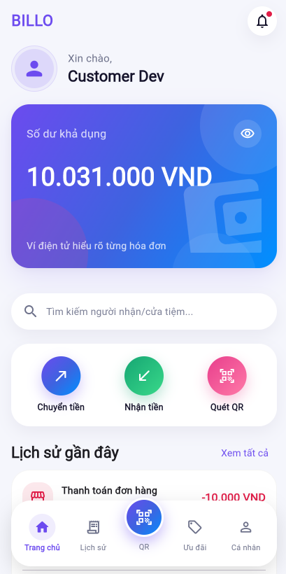

Chức năng liên quan: DynamoDB Main Table (wallet, transaction).

### 1.4. Chuyển tiền

Customer chuyển tiền cho người dùng khác bằng số điện thoại, xác nhận bằng PIN giao dịch.

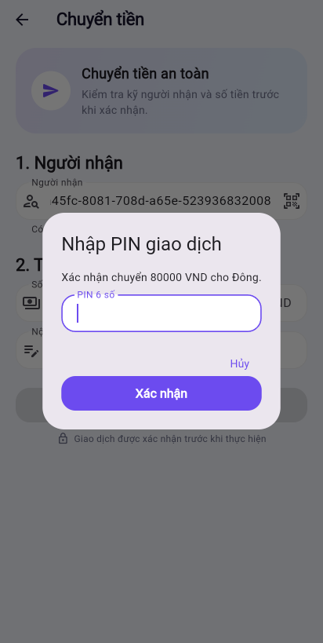

Chức năng liên quan: DynamoDB Idempotency Table (chống trùng giao dịch).

### 1.5. Quét QR bàn và gọi món

Customer quét QR bàn của quán để mở menu, chọn món và gửi order.

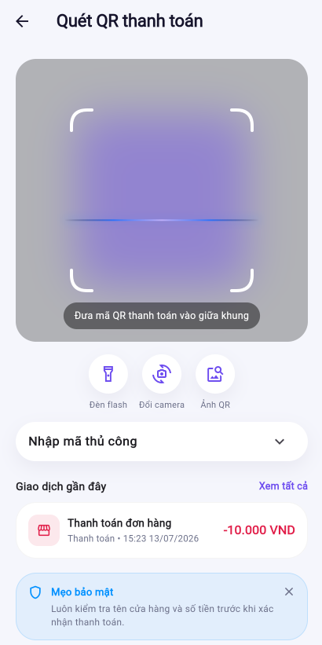

Chức năng liên quan: DynamoDB Main Table (table, order).

### 1.6. Thanh toán hóa đơn QR

Customer quét QR thanh toán do Merchant tạo, kiểm tra hóa đơn và xác nhận thanh toán bằng PIN.


Chức năng liên quan: DynamoDB (payment session, transaction).

---

## 2. Chức năng theo vai trò Merchant

### 2.1. Đăng ký kinh doanh

Customer gửi hồ sơ đăng ký kinh doanh kèm ảnh giấy phép kinh doanh để chờ Admin duyệt.

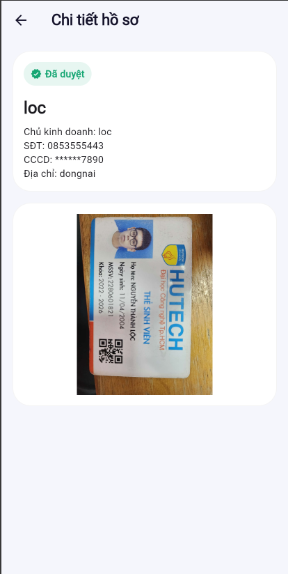

Chức năng liên quan: Amazon S3 (upload tài liệu qua pre-signed URL).

### 2.2. Không gian kinh doanh

Sau khi được duyệt và đăng nhập lại, Merchant truy cập được các tab Tổng quan, Dịch vụ, Bàn, POS, Đơn hàng.

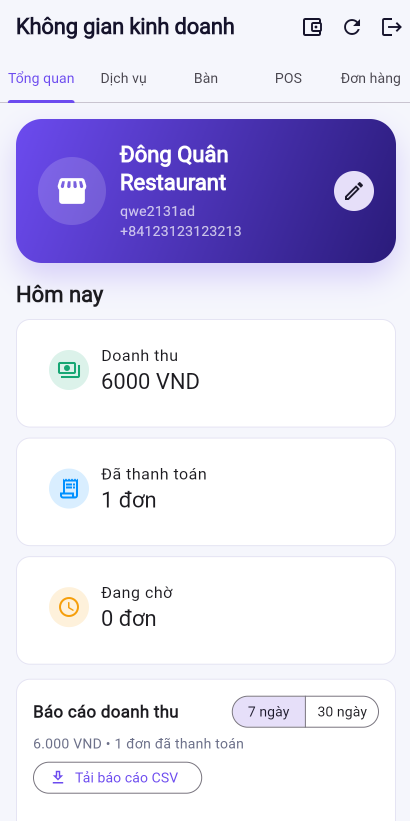

Chức năng liên quan: Cognito User Group `Merchant`.

### 2.3. Quản lý danh mục và sản phẩm/dịch vụ

Merchant tạo danh mục, thêm sản phẩm/dịch vụ với tên, giá, ảnh, trạng thái bán và cấu hình giảm giá.


Chức năng liên quan: DynamoDB Main Table, Amazon S3 (ảnh sản phẩm).

### 2.4. Quản lý bàn và QR bàn

Merchant tạo bàn, hệ thống sinh QR cho từng bàn để in và dán tại quán.

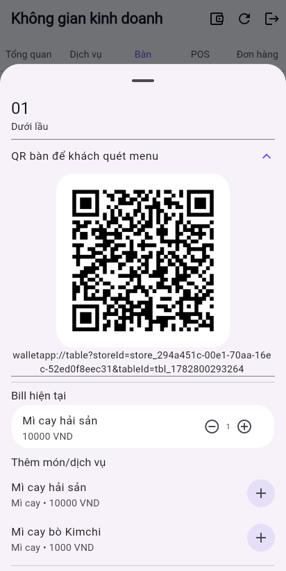

Chức năng liên quan: DynamoDB Main Table (table).

### 2.5. Nhận order và xử lý bill

Merchant xem order của từng bàn theo thời gian thực, có thể thêm/xóa/sửa món trước khi thanh toán.

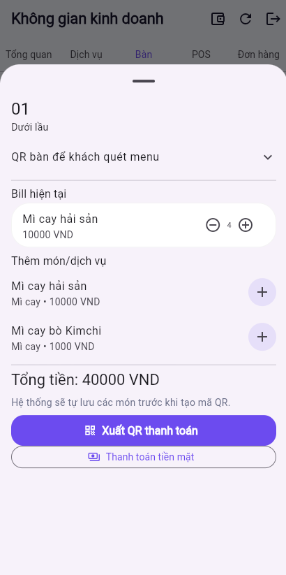

Chức năng liên quan: DynamoDB Main Table (order, bill).

### 2.6. Thanh toán

Merchant tạo QR thanh toán cho Customer quét, hoặc đánh dấu thanh toán tiền mặt trực tiếp.

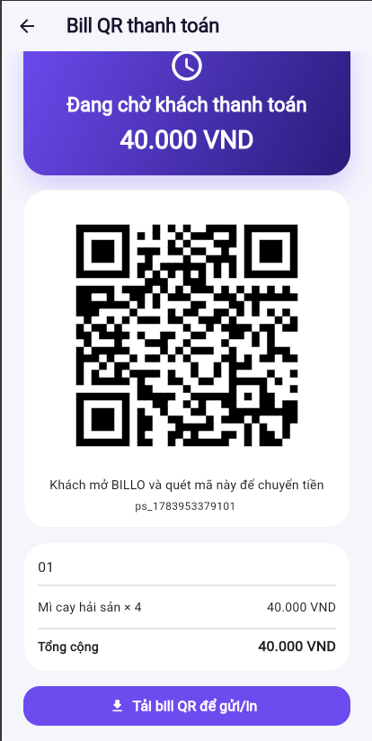

Chức năng liên quan: DynamoDB (payment session, transaction), ví Merchant được cộng tiền.

---

## 3. Chức năng theo vai trò Admin

Admin Web hiện được host trên AWS Amplify tại: `https://dev.d3k8atm3w5sdj3.amplifyapp.com`, kết nối cùng API Gateway endpoint với Flutter app.

### 3.1. Đăng nhập Admin

Đăng nhập bằng tài khoản thuộc Cognito group `Admin`.

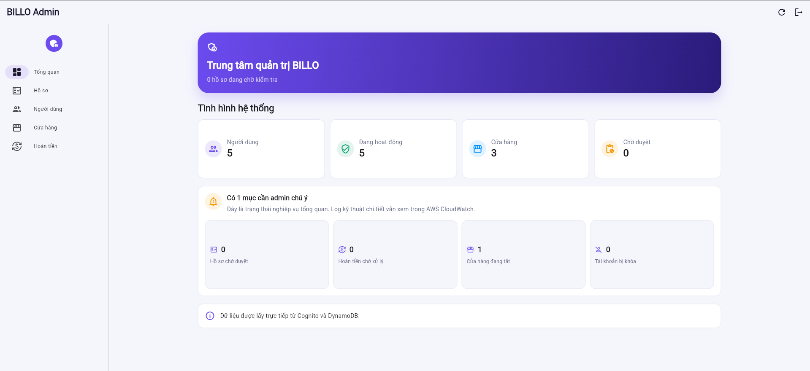

Chức năng liên quan: Amazon Cognito (User Group `Admin`).

### 3.2. Dashboard tổng quan

Admin xem nhanh số hồ sơ chờ duyệt, số cửa hàng, số user, giao dịch gần đây, hoàn tiền chờ xử lý.


Chức năng liên quan: DynamoDB Main Table.

### 3.3. Duyệt / Từ chối hồ sơ Merchant

Admin xem chi tiết hồ sơ đăng ký kinh doanh và quyết định duyệt hoặc từ chối.

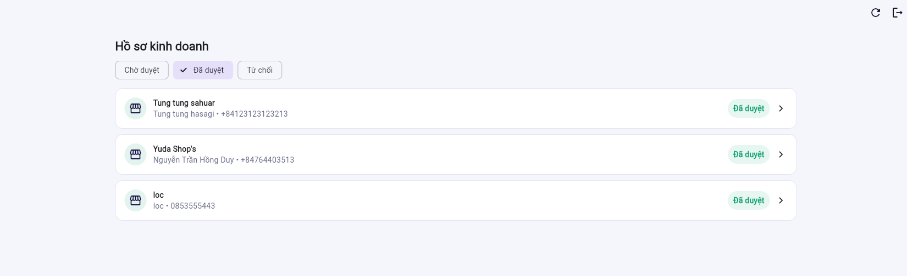

Khi duyệt, hệ thống tự động thêm user vào group `Merchant` trong Cognito và tạo Store record.

### 3.4. Quản lý người dùng và cửa hàng

Admin xem danh sách user, khóa/mở khóa tài khoản, thu hồi quyền Merchant, bật/tắt trạng thái hoạt động cửa hàng.

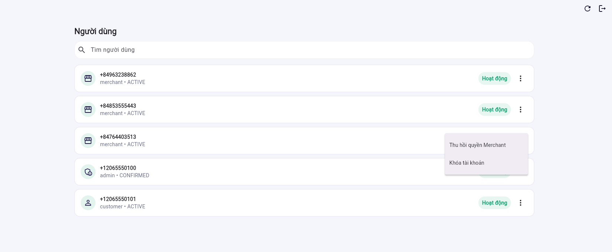

Chức năng liên quan: Amazon Cognito (User Group), DynamoDB Main Table.

### 3.5. Giao dịch và hoàn tiền

Admin xem chi tiết giao dịch, duyệt hoặc từ chối yêu cầu hoàn tiền.

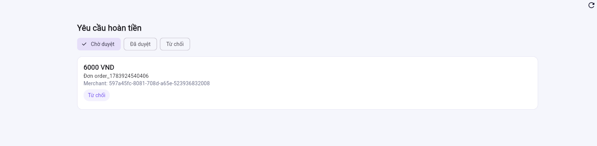

Chức năng liên quan: DynamoDB Main Table (transaction, refund).

---

## Luồng tổng thể

Sơ đồ tóm tắt cách ba vai trò phối hợp với nhau, đúng như đã demo end-to-end ở phần 5.7:

```text
Customer đăng ký & đăng ký kinh doanh
        ↓
Admin duyệt hồ sơ Merchant
        ↓
Merchant tạo cửa hàng, sản phẩm, bàn, QR bàn
        ↓
Customer quét QR bàn, gọi món
        ↓
Merchant xử lý bill, tạo QR thanh toán
        ↓
Customer thanh toán bằng PIN
        ↓
Admin giám sát giao dịch & xử lý hoàn tiền (nếu có)
```

---

## Kết quả mong đợi

Sau khi hoàn thành phần này:

- Người xem hiểu được AWS BILLO là ứng dụng gì và gồm những vai trò nào.
- Người xem thấy được từng chức năng cụ thể của Customer, Merchant và Admin qua ảnh chụp màn hình thực tế.
- Người xem hiểu được mối liên hệ giữa từng chức năng và dịch vụ AWS phía sau (Cognito, S3, DynamoDB...).
- Người xem nắm được luồng nghiệp vụ tổng thể kết nối ba vai trò với nhau.