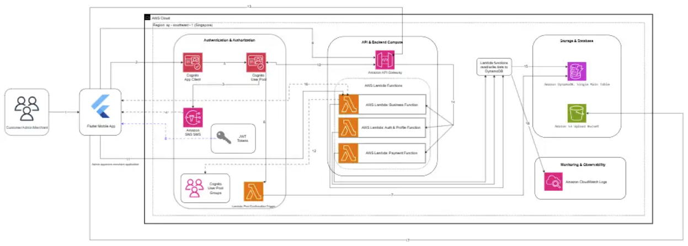

---
title: "Workshop"
date: 2026-06-29
weight: 5
chapter: false
pre: " <b> 5. </b> "
---

---

# AWS BILLO Workshop

## Deploying the Serverless Backend and Running the Application Demo

This workshop introduces how to deploy and test the **AWS BILLO** project, a serverless digital wallet and merchant management system built on AWS.

AWS BILLO combines a simulated internal wallet, Merchant POS functionality, table ordering via QR codes, QR payments, store management, and an Admin workflow for reviewing and approving Merchant registrations. The system is designed for three primary roles: **Customer**, **Merchant**, and **Admin**.

The main objective of this workshop is to guide participants through deploying the backend using AWS serverless services and running the frontend locally for demonstration purposes.

---

## Workshop Scope

This workshop focuses exclusively on the AWS services and tools currently used in the AWS BILLO project:

- **Amazon Cognito** for user authentication, OTP verification, JWT token issuance, and user group management.
- **Amazon API Gateway** for exposing secured backend APIs.
- **AWS Lambda** for implementing backend business logic.
- **Amazon DynamoDB** for storing application data.
- **DynamoDB Idempotency Table** for preventing duplicate processing during money transfers and payment operations.
- **Amazon S3** for storing images and business registration documents.
- **Amazon CloudWatch Logs** for monitoring and debugging Lambda functions and APIs.
- **AWS SAM** for building and deploying the serverless backend.
- **AWS CloudFormation** for managing AWS resources through infrastructure stacks.

The Flutter frontend and Admin Web application currently run locally during development. Hosting with AWS Amplify, Amazon S3, or Amazon CloudFront is outside the scope of this workshop.

---

## System Architecture

AWS BILLO uses a serverless architecture deployed in the AWS Singapore Region (`ap-southeast-1`).

The frontend communicates with Amazon Cognito for authentication and Amazon API Gateway for backend API requests. API Gateway validates JWT tokens issued by Cognito before forwarding requests to AWS Lambda. Lambda executes the core business logic and stores data in DynamoDB. Amazon S3 stores uploaded images and business documents, while CloudWatch Logs is used for monitoring and troubleshooting.

---

## Workshop Sections

### [5.1 - Workshop Overview](5.1-Workshop-overview/)

This section introduces the AWS BILLO project, the workshop objectives, the overall system architecture, and the primary AWS services used.

### [5.2 - Prerequisites](5.2-Prerequisites/)

This section lists the required tools, AWS accounts, access permissions, and local development environment needed before deploying the backend and running the application.

### [5.3 - Deploy AWS BILLO Backend](5.3-Deploy-backend/)

This section demonstrates how to build and deploy the backend using AWS SAM and AWS CloudFormation.

### [5.4 - Configure Authentication](5.4-Configure-authentication/)

This section explains how Amazon Cognito is used for phone number registration, OTP verification, user sign-in, JWT token issuance, and user group management.

### [5.5 - Run the Flutter Frontend Demo](5.5-Run-frontend-demo/)

This section demonstrates how to run the Flutter application locally and connect it to the deployed AWS backend.

### [5.6 - Run the Admin Web Demo](5.6-Run-admin-web-demo/)

This section explains how to run the Admin Web application locally to review and approve Merchant registration requests.

### [5.7 - Test the Main Business Flows](5.7-Test-main-business-flows/)

This section demonstrates the core business workflows, including Customer registration, Merchant approval, product creation, table QR code generation, table ordering, QR payment, and transaction history.

### [5.8 - Monitoring and Cleanup](5.8-Monitoring-and-cleanup/)

This section explains how to view Lambda logs in CloudWatch and clean up AWS resources after completing the workshop.

### [5.9 - Project Overview](5.9-Project-overview/)

This section presents the major features of AWS BILLO for each user role (Customer, Merchant, and Admin), including screenshots and step-by-step demonstrations of each feature. Additional details are provided in Sections 5.9.1, 5.9.2, and 5.9.3.

---

## Expected Outcomes

After completing this workshop, participants will be able to:

- Understand the serverless architecture of AWS BILLO.
- Deploy the backend using AWS SAM.
- Use Amazon Cognito for authentication and group-based authorization.
- Connect the Flutter frontend to the deployed Amazon API Gateway endpoint.
- Run the Admin Web application locally.
- Test the core workflows for Customer, Merchant, and Admin.
- Monitor backend logs using Amazon CloudWatch Logs.
- Clean up AWS resources after testing.

---

## Important Notes

This workshop is designed for development and demonstration purposes.

The system is **not** intended to be a production financial platform. Wallet balances and transactions are simulated and used solely for demonstration.

Amazon Cognito SMS OTP depends on your AWS SMS sandbox or production SMS configuration. During development, only verified phone numbers can receive OTP messages.

The Flutter frontend and Admin Web application currently run locally. Deploying and hosting them with AWS Amplify, Amazon S3, or Amazon CloudFront is not covered in this workshop.